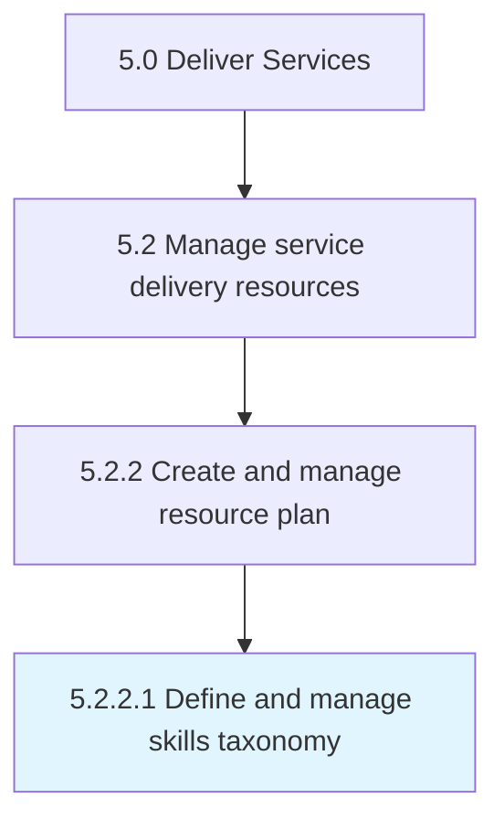

# Define and manage skills taxonomy

> Analyzing the skills needed to perform services to be delivered.

## Overview

Activity 5.2.2.1 is an activity within the Deliver Services framework. 

Analyzing the skills needed to perform services to be delivered. Classify and organize these skills requirements.

## Process Hierarchy



## Key Statistics

| Metric | Value |
|--------|-------|
| APQC Code | 20051 |
| Hierarchy ID | 5.2.2.1 |
| Level | Activity |
| Parent | [5.2.2](../) |
| Sub-Processes | 0 |


## GraphDL Semantic Structure

```
define.AndManageSkillsTaxonomy
```

| Component | Value | Description |
|-----------|-------|-------------|
| Verb | `define` | Primary action |
| Object | `and manage skills taxonomy` | Direct object |


## Related Concepts

- [SkillsTaxonomy](/concepts/SkillsTaxonomy)
- [SkillsTaxonomy](/concepts/SkillsTaxonomy)


---

*Source: APQC PCF 20051 (5.2.2.1) - APQC*
