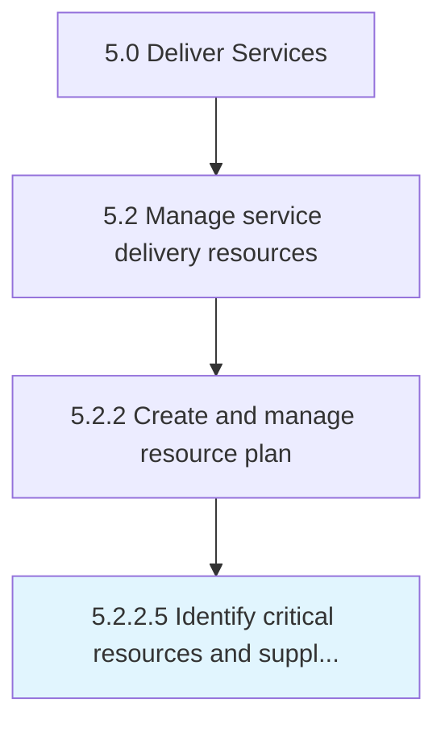

# Identify critical resources and supplier capacity

> Realizing critical resources required to perform and carry out customer needs.

## Overview

Activity 5.2.2.5 is an activity within the Deliver Services framework. 

Realizing critical resources required to perform and carry out customer needs. Engage with suppliers to fulfill those needs, if necessary. Identify supplier threshold for performing those needs.

## Process Hierarchy



## Key Statistics

| Metric | Value |
|--------|-------|
| APQC Code | 20055 |
| Hierarchy ID | 5.2.2.5 |
| Level | Activity |
| Parent | [5.2.2](../) |
| Sub-Processes | 0 |


## GraphDL Semantic Structure

```
identify.CriticalResourcesAndSupplierCapacity
```

| Component | Value | Description |
|-----------|-------|-------------|
| Verb | `identify` | Primary action |
| Object | `critical resources and supplier capacity` | Direct object |


## Related Concepts

- CriticalResourcesCapacity
- SupplierCapacity


---

*Source: APQC PCF 20055 (5.2.2.5) - APQC*
