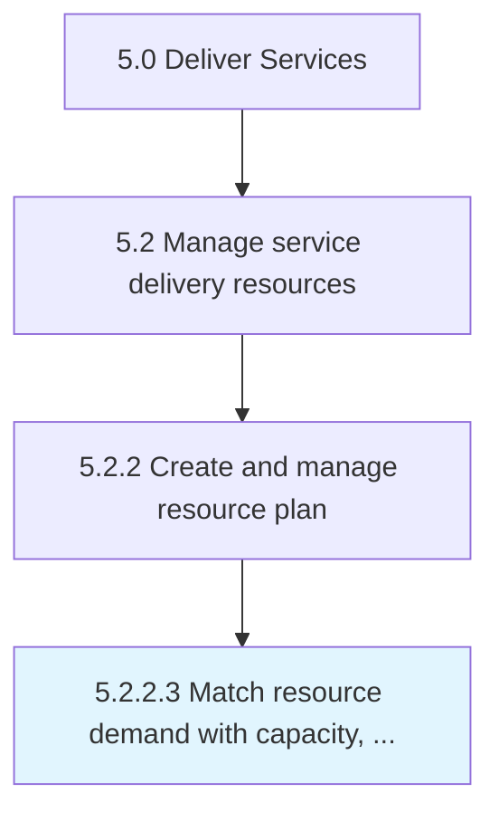

# Match resource demand with capacity, skills, and capabilities

> Matching demand with skills and capability.

## Overview

Activity 5.2.2.3 is an activity within the Deliver Services framework. 

Matching demand with skills and capability. Enlisting suppliers and partners to help with demand when needed.

## Process Hierarchy



## Key Statistics

| Metric | Value |
|--------|-------|
| APQC Code | 20053 |
| Hierarchy ID | 5.2.2.3 |
| Level | Activity |
| Parent | [5.2.2](../) |
| Sub-Processes | 0 |


## GraphDL Semantic Structure

```
match.ResourceDemand.with.CapacitySkillsAndCapabilities
```

| Component | Value | Description |
|-----------|-------|-------------|
| Verb | `match` | Primary action |
| Object | `resource demand` | Direct object |
| Preposition | `with` | Relationship |
| PrepObject | `capacity, skills, and capabilities` | Indirect object |


## Related Concepts

- [ResourceDemand](/concepts/ResourceDemand)
- [Capacity](/concepts/Capacity)
- [ResourceDemand](/concepts/ResourceDemand)
- [Skills](/concepts/Skills)
- [ResourceDemand](/concepts/ResourceDemand)
- [Capabilities](/concepts/Capabilities)


---

*Source: APQC PCF 20053 (5.2.2.3) - APQC*
