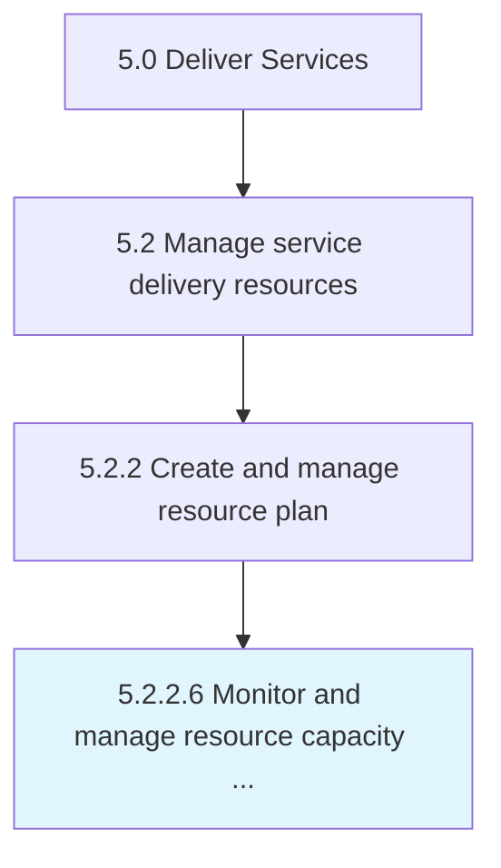

# Monitor and manage resource capacity and availability

> Directing and managing workforce needs.

## Overview

Activity 5.2.2.6 is an activity within the Deliver Services framework. 

Directing and managing workforce needs. Ensure that resources are at full capacity. Monitor that all resources are able to skilled in their respective rolls. Make sure that necessary resources are available to provide the needed services.

## Process Hierarchy



## Key Statistics

| Metric | Value |
|--------|-------|
| APQC Code | 20056 |
| Hierarchy ID | 5.2.2.6 |
| Level | Activity |
| Parent | [5.2.2](../) |
| Sub-Processes | 0 |


## GraphDL Semantic Structure

```
monitor.AndManageResourceCapacityAndAvailability
```

| Component | Value | Description |
|-----------|-------|-------------|
| Verb | `monitor` | Primary action |
| Object | `and manage resource capacity and availability` | Direct object |


## Related Concepts

- [ResourceCapacity](/concepts/ResourceCapacity)
- [Availability](/concepts/Availability)
- [ResourceCapacity](/concepts/ResourceCapacity)
- [Availability](/concepts/Availability)


---

*Source: APQC PCF 20056 (5.2.2.6) - APQC*
