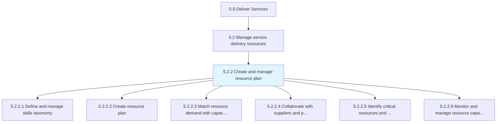
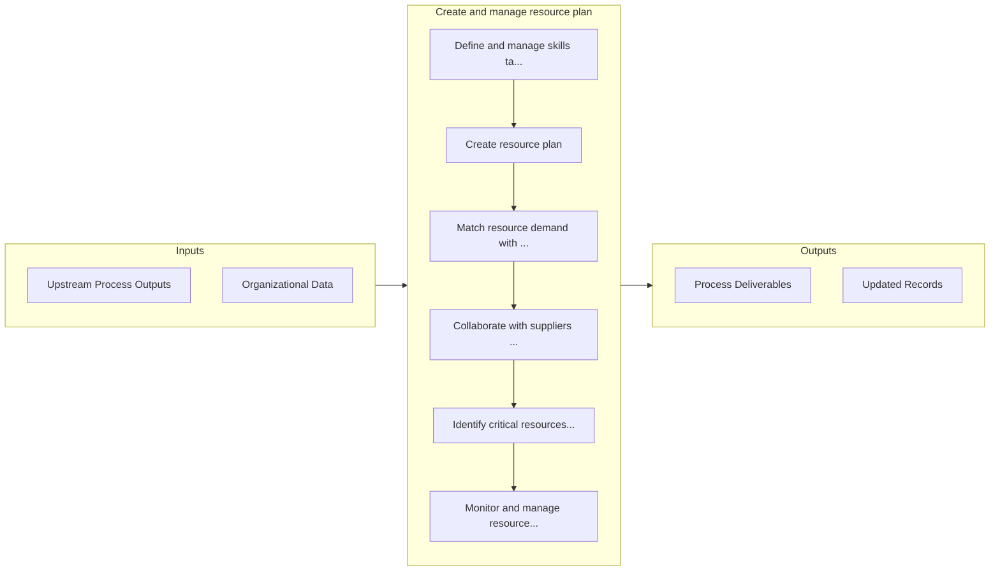

# Create and manage resource plan

> Identifying the need for and creating a resource plan.

## Overview

Process 5.2.2 is a core process that defines the specific procedures for create and manage resource plan. 

Identifying the need for and creating a resource plan. Understand resource demand and align with capacity, skills, and capabilities. Enlist suppliers and partners to supplement needed skills and capabilities. Monitor and manage capabilities and skills with an eye on critical resources and supplier capacity.

## Process Hierarchy



## Key Statistics

| Metric | Value |
|--------|-------|
| APQC Code | 20050 |
| Hierarchy ID | 5.2.2 |
| Level | Process |
| Parent | [5.2](../) |
| Sub-Processes | 6 |


## GraphDL Semantic Structure

```graphdl
create.AndManageResourcePlan
```

| Component | Value | Description |
|-----------|-------|-------------|
| Verb | `create` | Primary action |
| Object | `and manage resource plan` | Direct object |


## Process Flow



## Sub-Processes

| Process | Hierarchy ID | Description |
|---------|-------------|-------------|
| [Define and manage skills taxonomy](./DefineAndManageSkillsTaxonomy) | 5.2.2.1 | Analyzing the skills needed to perform services to be delivered |
| [Create resource plan](./CreateResourcePlan) | 5.2.2.2 | Creating a plan to ensure that all resources are available to carry out services required for the cu |
| [Match resource demand with capacity, skills, and capabilities](./MatchResourceDemandWithCapacitySkillsAndCapabilities) | 5.2.2.3 | Matching demand with skills and capability |
| [Collaborate with suppliers and partners to supplement skills and capabilities](./CollaborateWithSuppliersAndPartnersToSupplementSkillsAndCapabilities) | 5.2.2.4 | Understanding organizational need to enlist suppliers to provide resources for gaps in skills and ca |
| [Identify critical resources and supplier capacity](./IdentifyCriticalResourcesAndSupplierCapacity) | 5.2.2.5 | Realizing critical resources required to perform and carry out customer needs |
| [Monitor and manage resource capacity and availability](./MonitorAndManageResourceCapacityAndAvailability) | 5.2.2.6 | Directing and managing workforce needs |


## Related Concepts

- ResourcePlan
- ResourcePlan


---

*Source: APQC PCF 20050 (5.2.2) - APQC*
