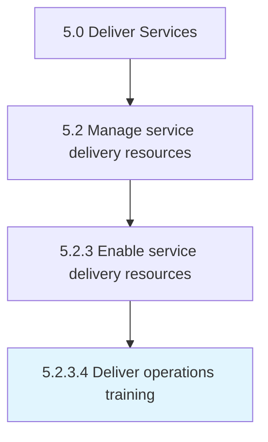

# Deliver operations training

> Educating service delivery personnel on all aspects of the operations process of the organization.

## Overview

Activity 5.2.3.4 is an activity within the Deliver Services framework. 

Educating service delivery personnel on all aspects of the operations process of the organization.

## Process Hierarchy



## Key Statistics

| Metric | Value |
|--------|-------|
| APQC Code | 12132 |
| Hierarchy ID | 5.2.3.4 |
| Level | Activity |
| Parent | [5.2.3](../) |
| Sub-Processes | 0 |


## GraphDL Semantic Structure

```
deliver.OperationsTraining
```

| Component | Value | Description |
|-----------|-------|-------------|
| Verb | `deliver` | Primary action |
| Object | `operations training` | Direct object |


## Related Concepts

- [OperationsTraining](/concepts/OperationsTraining)


---

*Source: APQC PCF 12132 (5.2.3.4) - APQC*
