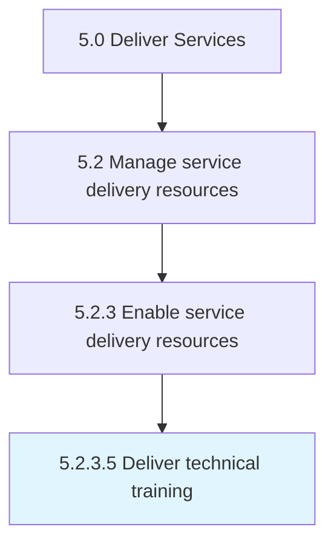

# Deliver technical training

> Ensuring that all personnel are trained on all technical aspects of service delivery.

## Overview

Activity 5.2.3.5 is an activity within the Deliver Services framework. 

Ensuring that all personnel are trained on all technical aspects of service delivery.

## Process Hierarchy



## Key Statistics

| Metric | Value |
|--------|-------|
| APQC Code | 12133 |
| Hierarchy ID | 5.2.3.5 |
| Level | Activity |
| Parent | [5.2.3](../) |
| Sub-Processes | 0 |


## GraphDL Semantic Structure

```
deliver.TechnicalTraining
```

| Component | Value | Description |
|-----------|-------|-------------|
| Verb | `deliver` | Primary action |
| Object | `technical training` | Direct object |


## Related Concepts

- [TechnicalTraining](/concepts/TechnicalTraining)


---

*Source: APQC PCF 12133 (5.2.3.5) - APQC*
