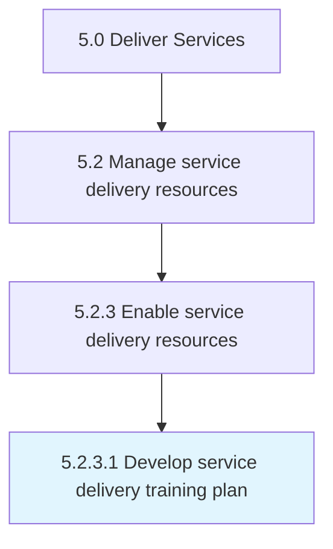

# Develop service delivery training plan

> Creating a detailed summary of all the actions relevant to teaching a person a particular skill or type of behavior.

## Overview

Activity 5.2.3.1 is an activity within the Deliver Services framework. 

Creating a detailed summary of all the actions relevant to teaching a person a particular skill or type of behavior. Determine who will deliver the training. Determine when and where the apprentice or trainee needs to go to receive the structured component of the training.

## Process Hierarchy



## Key Statistics

| Metric | Value |
|--------|-------|
| APQC Code | 12128 |
| Hierarchy ID | 5.2.3.1 |
| Level | Activity |
| Parent | [5.2.3](../) |
| Sub-Processes | 0 |


## GraphDL Semantic Structure

```
develop.ServiceDeliveryTrainingPlan
```

| Component | Value | Description |
|-----------|-------|-------------|
| Verb | `develop` | Primary action |
| Object | `service delivery training plan` | Direct object |


## Related Concepts

- ServiceDeliveryTrainingPlan


---

*Source: APQC PCF 12128 (5.2.3.1) - APQC*
