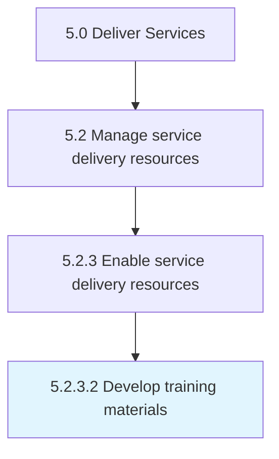

# Develop training materials

> Developing materials necessary to provide comprehensive training for the skills or behavior needed to deliver services.

## Overview

Activity 5.2.3.2 is an activity within the Deliver Services framework. 

Developing materials necessary to provide comprehensive training for the skills or behavior needed to deliver services. This can be any number for formats such as classroom or computer based training.

## Process Hierarchy



## Key Statistics

| Metric | Value |
|--------|-------|
| APQC Code | 12129 |
| Hierarchy ID | 5.2.3.2 |
| Level | Activity |
| Parent | [5.2.3](../) |
| Sub-Processes | 0 |


## GraphDL Semantic Structure

```
develop.TrainingMaterials
```

| Component | Value | Description |
|-----------|-------|-------------|
| Verb | `develop` | Primary action |
| Object | `training materials` | Direct object |


## Related Concepts

- [TrainingMaterials](/concepts/TrainingMaterials)


---

*Source: APQC PCF 12129 (5.2.3.2) - APQC*
