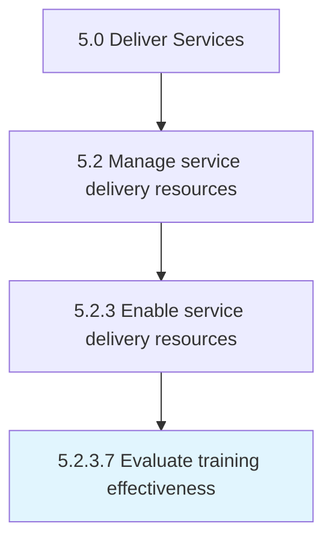

# Evaluate training effectiveness

> Eliciting feedback from various sources to evaluate the training provided.

## Overview

Activity 5.2.3.7 is an activity within the Deliver Services framework. 

Eliciting feedback from various sources to evaluate the training provided. This can be achieved through testing and the practical application of skills. Additionally, manager or student feedback can be garnered to evaluate training effectiveness.

## Process Hierarchy



## Key Statistics

| Metric | Value |
|--------|-------|
| APQC Code | 12135 |
| Hierarchy ID | 5.2.3.7 |
| Level | Activity |
| Parent | [5.2.3](../) |
| Sub-Processes | 0 |


## GraphDL Semantic Structure

```
evaluate.TrainingEffectiveness
```

| Component | Value | Description |
|-----------|-------|-------------|
| Verb | `evaluate` | Primary action |
| Object | `training effectiveness` | Direct object |


## Related Concepts

- [TrainingEffectiveness](/concepts/TrainingEffectiveness)


---

*Source: APQC PCF 12135 (5.2.3.7) - APQC*
