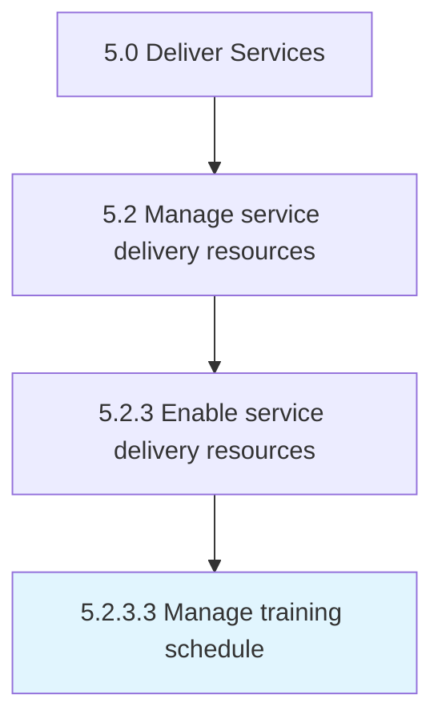

# Manage training schedule

> Providing training to the employee within a manageable timeframe to meet the needs of both the individual and the organization.

## Overview

Activity 5.2.3.3 is an activity within the Deliver Services framework. 

Providing training to the employee within a manageable timeframe to meet the needs of both the individual and the organization.

## Process Hierarchy



## Key Statistics

| Metric | Value |
|--------|-------|
| APQC Code | 12131 |
| Hierarchy ID | 5.2.3.3 |
| Level | Activity |
| Parent | [5.2.3](../) |
| Sub-Processes | 0 |


## GraphDL Semantic Structure

```
manage.TrainingSchedule
```

| Component | Value | Description |
|-----------|-------|-------------|
| Verb | `manage` | Primary action |
| Object | `training schedule` | Direct object |


## Related Concepts

- TrainingSchedule


---

*Source: APQC PCF 12131 (5.2.3.3) - APQC*
