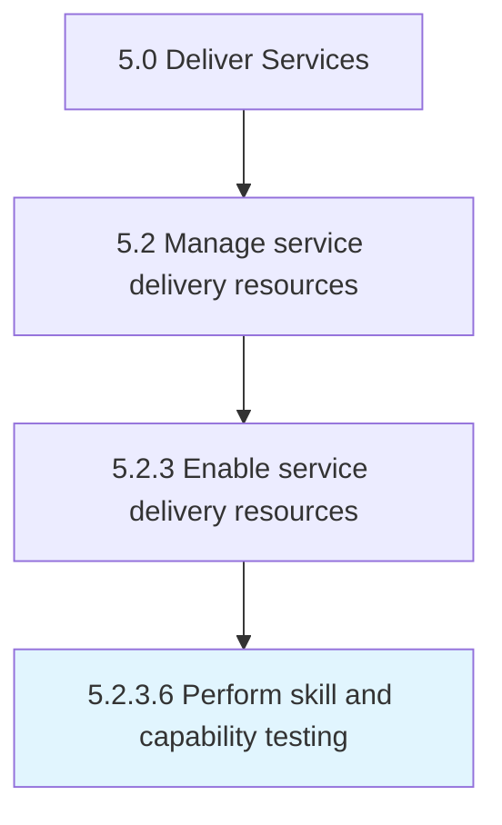

# Perform skill and capability testing

> Verifying that training provided to the person was successful through the administration testing and the application of skills for practical use.

## Overview

Activity 5.2.3.6 is an activity within the Deliver Services framework. 

Verifying that training provided to the person was successful through the administration testing and the application of skills for practical use.

## Process Hierarchy



## Key Statistics

| Metric | Value |
|--------|-------|
| APQC Code | 20057 |
| Hierarchy ID | 5.2.3.6 |
| Level | Activity |
| Parent | [5.2.3](../) |
| Sub-Processes | 0 |


## GraphDL Semantic Structure

```
perform.SkillAndCapabilityTesting
```

| Component | Value | Description |
|-----------|-------|-------------|
| Verb | `perform` | Primary action |
| Object | `skill and capability testing` | Direct object |


## Related Concepts

- [Skill](/concepts/Skill)
- [CapabilityTesting](/concepts/CapabilityTesting)


---

*Source: APQC PCF 20057 (5.2.3.6) - APQC*
