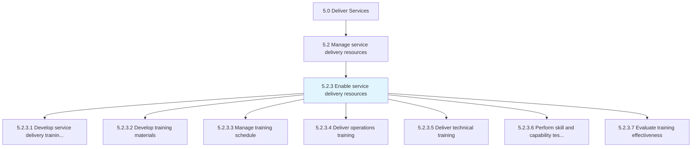
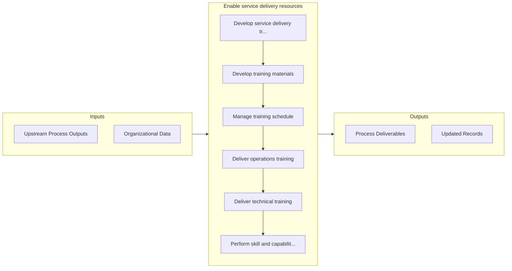

# Enable service delivery resources

> Instituting training to enable resources to provide service delivery to the customer.

## Overview

Process 5.2.3 is a core process that defines the specific procedures for enable service delivery resources. 

Instituting training to enable resources to provide service delivery to the customer. Develop a training plan. Create materials that provide for operation and technical training. Schedule, perform, and evaluate training.

## Process Hierarchy



## Key Statistics

| Metric | Value |
|--------|-------|
| APQC Code | 12127 |
| Hierarchy ID | 5.2.3 |
| Level | Process |
| Parent | [5.2](../) |
| Sub-Processes | 7 |


## GraphDL Semantic Structure

```graphdl
enable.ServiceDeliveryResources
```

| Component | Value | Description |
|-----------|-------|-------------|
| Verb | `enable` | Primary action |
| Object | `service delivery resources` | Direct object |


## Process Flow



## Sub-Processes

| Process | Hierarchy ID | Description |
|---------|-------------|-------------|
| [Develop service delivery training plan](./DevelopServiceDeliveryTrainingPlan) | 5.2.3.1 | Creating a detailed summary of all the actions relevant to teaching a person a particular skill or t |
| [Develop training materials](./DevelopTrainingMaterials) | 5.2.3.2 | Developing materials necessary to provide comprehensive training for the skills or behavior needed t |
| [Manage training schedule](./ManageTrainingSchedule) | 5.2.3.3 | Providing training to the employee within a manageable timeframe to meet the needs of both the indiv |
| [Deliver operations training](./DeliverOperationsTraining) | 5.2.3.4 | Educating service delivery personnel on all aspects of the operations process of the organization |
| [Deliver technical training](./DeliverTechnicalTraining) | 5.2.3.5 | Ensuring that all personnel are trained on all technical aspects of service delivery |
| [Perform skill and capability testing](./PerformSkillAndCapabilityTesting) | 5.2.3.6 | Verifying that training provided to the person was successful through the administration testing and |
| [Evaluate training effectiveness](./EvaluateTrainingEffectiveness) | 5.2.3.7 | Eliciting feedback from various sources to evaluate the training provided |


## Related Concepts

- ServiceDeliveryResources


---

*Source: APQC PCF 12127 (5.2.3) - APQC*
