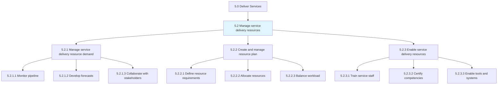
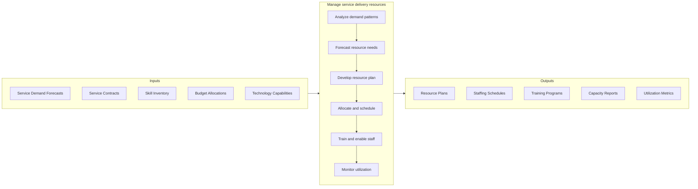
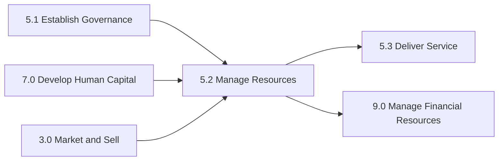

# Manage service delivery resources

> Understanding the demands on resources and creating a plan to enable the delivery of services via those resources.

## Overview

Group 5.2 is a process group within APQC Category 5.0 (Deliver Services). This critical process group ensures that organizations have the right resources, in the right quantities, with the right capabilities, at the right time to deliver services effectively.

Understanding the demands on resources and creating a plan to enable the delivery of services via those resources. This encompasses demand forecasting, capacity planning, resource allocation, skills development, and workforce enablement. Effective resource management directly impacts service quality, customer satisfaction, and operational efficiency.

Resource management in service delivery differs from manufacturing in its emphasis on human capital, knowledge workers, and the perishable nature of service capacity. Unlike physical inventory, service capacity that goes unused cannot be stored for future use, making accurate demand forecasting and resource planning essential.

## Process Hierarchy



## Key Statistics

| Metric | Value |
|--------|-------|
| APQC Code | 20040 |
| Hierarchy ID | 5.2 |
| Level | Group |
| Parent | [5](../) |
| Sub-Processes | 3 |
| Activities | 9+ |
| Industry Variants | 19 |

## GraphDL Semantic Structure

```graphdl
manage.ServiceDeliveryResources
```

| Component | Value | Description |
|-----------|-------|-------------|
| Verb | `manage` | Primary action of overseeing and controlling |
| Object | `service delivery resources` | Human, technical, and material resources for service delivery |

## Process Flow



## Child Process Listings

### 5.2.1 - Manage service delivery resource demand

Ensuring necessary resources are maintained through monitoring pipeline, developing forecasts, and collaborating with stakeholders. This process provides visibility into future resource requirements and enables proactive planning.

**Key Activities:**
- Monitor service pipeline and demand signals
- Develop short-term and long-term resource forecasts
- Collaborate with sales and operations for demand alignment
- Analyze historical patterns and trends
- Identify seasonal and cyclical demand variations

[View Process Details](./5.2.1-ManageServiceDeliveryResource/)

### 5.2.2 - Create and manage resource plan

Identifying the need for and creating a resource plan that aligns capacity with demand. This process translates demand forecasts into actionable resource allocation decisions.

**Key Activities:**
- Define resource requirements by skill and capability
- Create staffing models and schedules
- Allocate resources to projects and engagements
- Balance workload across teams
- Manage resource conflicts and priorities

[View Process Details](./5.2.2-CreateManageResourcePlan/)

### 5.2.3 - Enable service delivery resources

Instituting training to enable resources to provide service delivery to the customer. This process ensures staff have the skills, tools, and knowledge to deliver services effectively.

**Key Activities:**
- Develop and deliver training programs
- Certify staff competencies and skills
- Provide access to tools and systems
- Enable knowledge sharing and collaboration
- Support continuous learning and development

[View Process Details](./5.2.3-EnableServiceDeliveryResources/)

## RACI Matrix

| Activity | Resource Manager | Service Delivery Manager | HR Director | Project Manager | Training Manager | Finance Director |
|----------|------------------|-------------------------|-------------|-----------------|------------------|------------------|
| Monitor demand pipeline | R | C | I | C | I | I |
| Develop resource forecasts | R | A | C | C | I | C |
| Create resource plan | R | A | C | C | I | C |
| Allocate resources | R | A | I | C | I | I |
| Balance workload | R | C | I | R | I | I |
| Develop training programs | C | I | C | I | R | A |
| Certify competencies | I | C | C | I | R | I |
| Enable tools and systems | C | C | I | I | R | A |
| Monitor utilization | R | A | I | C | I | R |

**Legend:** R = Responsible, A = Accountable, C = Consulted, I = Informed

## Metrics and KPIs

| Metric | Description | Target | Frequency |
|--------|-------------|--------|-----------|
| Resource Utilization Rate | Percentage of available capacity utilized | 75-85% | Weekly |
| Forecast Accuracy | Variance between forecasted and actual demand | <10% | Monthly |
| Time to Fill Positions | Average days to staff open resource requests | <14 days | Per occurrence |
| Training Completion Rate | Percentage of required training completed | >95% | Monthly |
| Skill Coverage Index | Percentage of required skills available | >90% | Quarterly |
| Bench Strength | Percentage of critical roles with backup | >80% | Quarterly |
| Resource Allocation Efficiency | Percentage of optimal resource matches | >85% | Monthly |
| Employee Readiness Score | Percentage of staff certified for service delivery | >90% | Quarterly |
| Cost per FTE | Total resource cost divided by full-time equivalents | Benchmark | Monthly |
| Overtime Rate | Percentage of hours worked as overtime | <10% | Monthly |

## Related Departments

- [Human Resources](/departments/HR) - Workforce planning and talent management
- [Operations](/departments/Operations) - Service delivery execution
- [Finance](/departments/Finance) - Resource budgeting and cost management
- [Training & Development](/departments/Training) - Skill development programs
- [Project Management Office](/departments/PMO) - Resource allocation and scheduling
- [Quality Assurance](/departments/Quality) - Competency standards and certification

## Related Occupations

- [Human Resources Managers](/occupations/Management/HumanResourcesManagers) - Workforce planning and HR strategy
- [Training and Development Managers](/occupations/Management/TrainingDevelopmentManagers) - Learning program design
- [Project Management Specialists](/occupations/Business/ProjectManagement/ProjectManagementSpecialists) - Resource scheduling
- [Compensation and Benefits Managers](/occupations/Management/CompensationBenefitsManagers) - Resource cost management
- [Operations Research Analysts](/occupations/Math/OperationsResearchAnalysts) - Capacity optimization
- [Management Analysts](/occupations/Business/Operations/ManagementAnalysts) - Resource process improvement

## Related Concepts

- ServiceDeliveryResources
- CapacityPlanning
- WorkforceManagement
- DemandForecasting
- SkillsDevelopment
- ResourceOptimization

## Related Processes



---

*Source: APQC PCF 20040 (5.2) - APQC*
