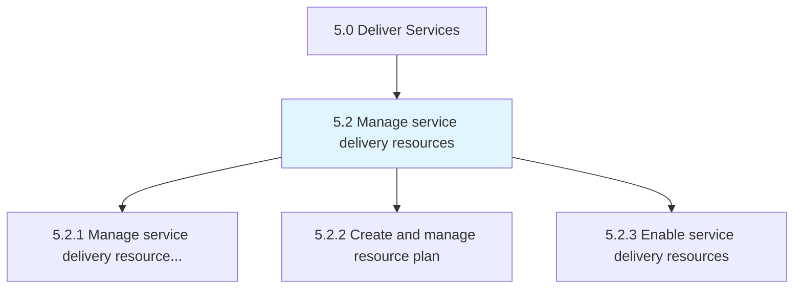
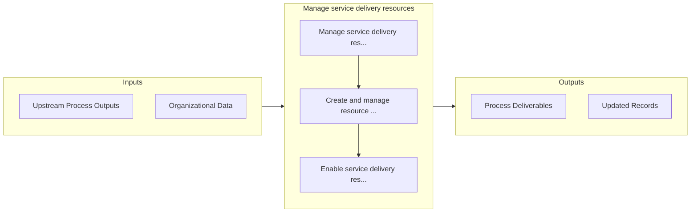

# Manage service delivery resources

> Understanding the demands on resources and creating a plan to enable the delivery of services via those resources.

## Overview

Group 5.2 is a process group within APQC Category 5.0 (Deliver Services). 

Understanding the demands on resources and creating a plan to enable the delivery of services via those resources.

## Process Hierarchy



## Key Statistics

| Metric | Value |
|--------|-------|
| APQC Code | 20040 |
| Hierarchy ID | 5.2 |
| Level | Group |
| Parent | [5](../) |
| Sub-Processes | 3 |


## GraphDL Semantic Structure

```graphdl
manage.ServiceDeliveryResources
```

| Component | Value | Description |
|-----------|-------|-------------|
| Verb | `manage` | Primary action |
| Object | `service delivery resources` | Direct object |


## Process Flow



## Sub-Processes

| Process | Hierarchy ID | Description |
|---------|-------------|-------------|
| [Manage service delivery resource demand](./5.2.1-ManageServiceDeliveryResource/) | 5.2.1 | Ensuring necessary resources are maintained through monitoring pipeline, developing forecasts, and c |
| [Create and manage resource plan](./5.2.2-CreateManageResourcePlan/) | 5.2.2 | Identifying the need for and creating a resource plan |
| [Enable service delivery resources](./5.2.3-EnableServiceDeliveryResources/) | 5.2.3 | Instituting training to enable resources to provide service delivery to the customer |


## Related Concepts

- ServiceDeliveryResources


---

*Source: APQC PCF 20040 (5.2) - APQC*
