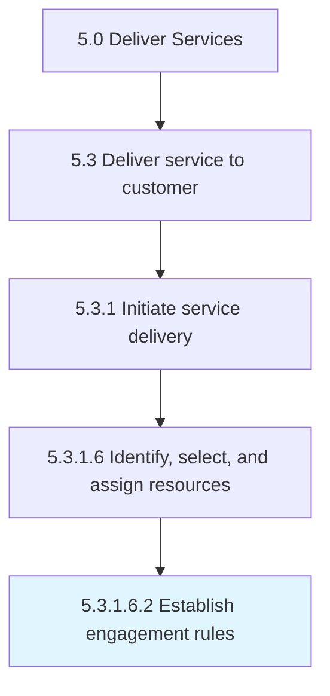

# Establish engagement rules

> Establishing guidelines for how resources engage with the customer.

## Overview

Sub-Activity 5.3.1.6.2 is an activity within the Deliver Services framework. 

Establishing guidelines for how resources engage with the customer. For example, set rules of accountability, interaction, and accommodation when engaging the customer. Resources should be polite, empathetic, and attentive.

## Process Hierarchy



## Key Statistics

| Metric | Value |
|--------|-------|
| APQC Code | 20067 |
| Hierarchy ID | 5.3.1.6.2 |
| Level | Sub-Activity |
| Parent | [5.3.1.6](../) |
| Sub-Processes | 0 |


## GraphDL Semantic Structure

```
establish.EngagementRules
```

| Component | Value | Description |
|-----------|-------|-------------|
| Verb | `establish` | Primary action |
| Object | `engagement rules` | Direct object |


## Related Concepts

- EngagementRules


---

*Source: APQC PCF 20067 (5.3.1.6.2) - APQC*
