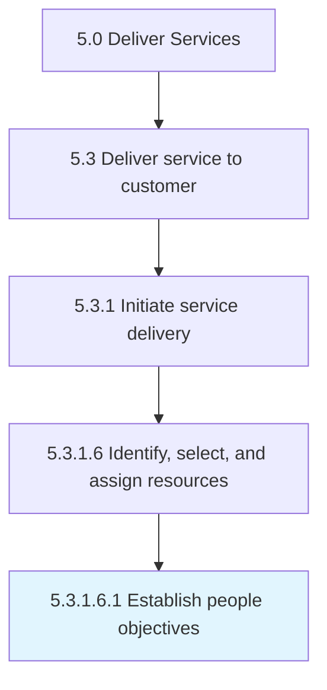

# Establish people objectives

> Providing the workforce with a plan of action and goals necessary to provide a service.

## Overview

Sub-Activity 5.3.1.6.1 is an activity within the Deliver Services framework. 

Providing the workforce with a plan of action and goals necessary to provide a service. Make sure that those objectives are met.

## Process Hierarchy



## Key Statistics

| Metric | Value |
|--------|-------|
| APQC Code | 20066 |
| Hierarchy ID | 5.3.1.6.1 |
| Level | Sub-Activity |
| Parent | [5.3.1.6](../) |
| Sub-Processes | 0 |


## GraphDL Semantic Structure

```
establish.PeopleObjectives
```

| Component | Value | Description |
|-----------|-------|-------------|
| Verb | `establish` | Primary action |
| Object | `people objectives` | Direct object |


## Related Concepts

- [PeopleObjectives](/concepts/PeopleObjectives)


---

*Source: APQC PCF 20066 (5.3.1.6.1) - APQC*
