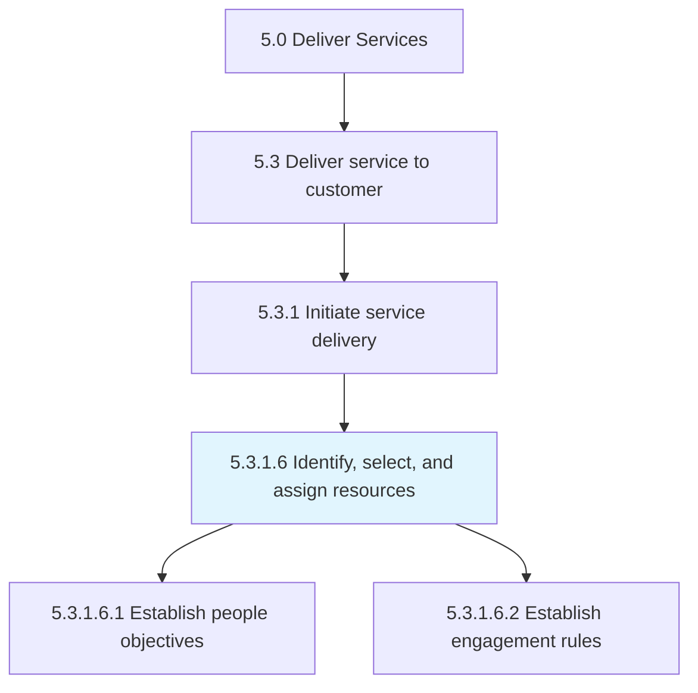
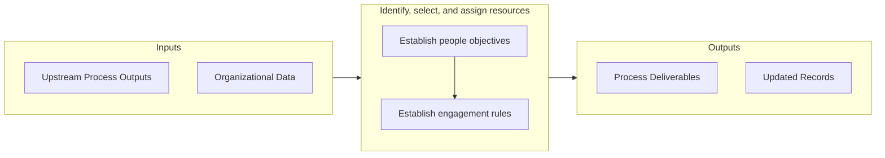

# Identify, select, and assign resources

> Identifying, selecting, and assigning resources required to deliver service to the customer.

## Overview

Activity 5.3.1.6 is an activity within the Deliver Services framework. 

Identifying, selecting, and assigning resources required to deliver service to the customer. Ensure that all objectives are established and met, and the all rules of engagement have been identified and communicated.

## Process Hierarchy



## Key Statistics

| Metric | Value |
|--------|-------|
| APQC Code | 20065 |
| Hierarchy ID | 5.3.1.6 |
| Level | Activity |
| Parent | [5.3.1](../) |
| Sub-Processes | 2 |


## GraphDL Semantic Structure

```graphdl
identify,.SelectAndAssignResources
```

| Component | Value | Description |
|-----------|-------|-------------|
| Verb | `identify,` | Primary action |
| Object | `select, and assign resources` | Direct object |


## Process Flow



## Sub-Processes

| Process | Hierarchy ID | Description |
|---------|-------------|-------------|
| [Establish people objectives](./EstablishPeopleObjectives) | 5.3.1.6.1 | Providing the workforce with a plan of action and goals necessary to provide a service |
| [Establish engagement rules](./EstablishEngagementRules) | 5.3.1.6.2 | Establishing guidelines for how resources engage with the customer |


## Related Concepts

- SelectAssignResources


---

*Source: APQC PCF 20065 (5.3.1.6) - APQC*
