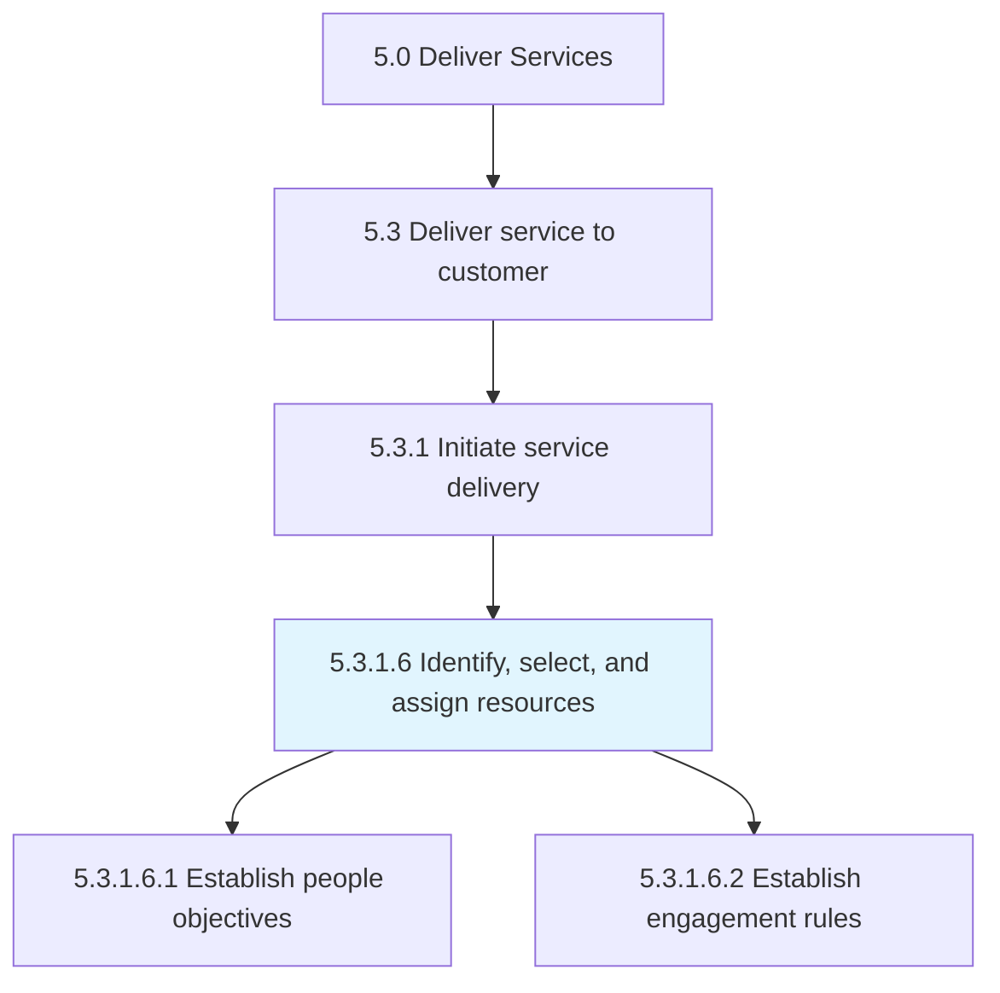
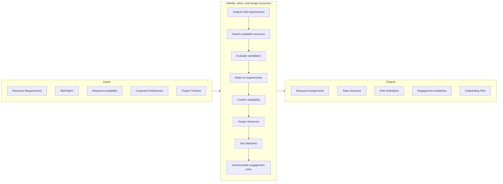
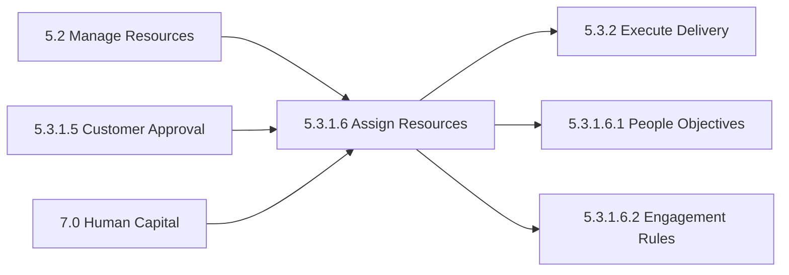

# Identify, select, and assign resources

> Identifying, selecting, and assigning resources required to deliver service to the customer.

## Overview

Activity 5.3.1.6 is an activity within the Deliver Services framework. This critical activity ensures the right team is assembled with the appropriate skills, availability, and customer fit to deliver services successfully.

Identifying, selecting, and assigning resources required to deliver service to the customer. Ensure that all objectives are established and met, and all rules of engagement have been identified and communicated. This activity bridges resource planning with active service delivery by matching available talent to specific customer requirements.

Effective resource assignment considers multiple factors including technical skills, domain expertise, customer relationship history, geographic location, language requirements, availability, and career development opportunities. The quality of resource selection directly impacts delivery success, customer satisfaction, and team engagement.

## Process Hierarchy



## Key Statistics

| Metric | Value |
|--------|-------|
| APQC Code | 20065 |
| Hierarchy ID | 5.3.1.6 |
| Level | Activity |
| Parent | [5.3.1](../) |
| Sub-Processes | 2 |
| Industry Variants | 19 |

## GraphDL Semantic Structure

```graphdl
identify.Resources.for.ServiceDelivery
select.Resources.for.ServiceDelivery
assign.Resources.to.ServiceEngagement
```

| Component | Value | Description |
|-----------|-------|-------------|
| Verb | `identify`, `select`, `assign` | Three-phase resource staffing action |
| Object | `resources` | Human and material resources |
| Preposition | `for`, `to` | Relationship to service delivery |
| PrepObject | `ServiceDelivery`, `ServiceEngagement` | Target assignment context |

## Process Flow



## Child Process Listings

### 5.3.1.6.1 - Establish people objectives

Providing the workforce with a plan of action and goals necessary to provide a service. This sub-activity ensures team members understand their individual and collective objectives for the engagement.

**Key Activities:**
- Define individual performance objectives
- Align team goals with customer outcomes
- Establish measurable success criteria
- Communicate expectations clearly
- Create accountability framework
- Set development objectives

[View Process Details](./EstablishPeopleObjectives)

### 5.3.1.6.2 - Establish engagement rules

Establishing guidelines for how resources engage with the customer. This sub-activity sets the behavioral and operational standards for customer interaction.

**Key Activities:**
- Define communication protocols
- Establish escalation procedures
- Set response time expectations
- Define decision-making authority
- Specify documentation requirements
- Clarify customer interaction boundaries

[View Process Details](./EstablishEngagementRules)

## RACI Matrix

| Activity | Resource Manager | Project Manager | Service Delivery Lead | Team Member | Account Manager | HR Partner |
|----------|------------------|-----------------|----------------------|-------------|-----------------|------------|
| Analyze skill requirements | C | R | A | I | C | I |
| Search available resources | R | C | C | I | I | I |
| Evaluate candidates | R | R | A | I | C | C |
| Match to requirements | R | C | A | I | C | I |
| Confirm availability | R | C | C | R | I | I |
| Assign resources | R | C | A | I | I | I |
| Set objectives | C | R | A | R | C | I |
| Communicate engagement rules | I | R | A | R | C | I |
| Onboard team members | C | R | C | R | I | C |

**Legend:** R = Responsible, A = Accountable, C = Consulted, I = Informed

## Metrics and KPIs

| Metric | Description | Target | Frequency |
|--------|-------------|--------|-----------|
| Time to Staff | Days from request to confirmed assignment | <5 days | Per assignment |
| Skill Match Rate | Percentage of required skills met by assigned team | >90% | Per engagement |
| Resource Availability | Percentage of requested resources assigned | >85% | Per engagement |
| Customer Acceptance Rate | Percentage of proposed resources accepted | >95% | Per engagement |
| Team Stability | Percentage of assigned resources completing engagement | >90% | Per engagement |
| Utilization Start Accuracy | Actual start date vs. planned start date | +/- 2 days | Per assignment |
| Objective Clarity Score | Team member understanding of objectives | >4.5/5.0 | Per engagement |
| Onboarding Completion | Percentage of onboarding tasks completed | 100% | Per assignment |
| Resource Conflict Rate | Percentage of assignments with scheduling conflicts | <10% | Monthly |
| Skill Gap Identification | Time to identify training needs | <3 days | Per assignment |

## Related Departments

- [Human Resources](/departments/HR) - Resource sourcing and workforce data
- [Project Management Office](/departments/PMO) - Resource allocation governance
- [Operations](/departments/Operations) - Resource utilization tracking
- [Training & Development](/departments/Training) - Skills assessment and gap analysis
- [Resource Management](/departments/ResourceManagement) - Capacity planning and scheduling
- [Customer Success](/departments/CustomerSuccess) - Customer preference management

## Related Occupations

- [Human Resources Specialists](/occupations/Business/HR/HumanResourcesSpecialists) - Resource sourcing
- [Project Management Specialists](/occupations/Business/ProjectManagement/ProjectManagementSpecialists) - Team assembly
- [Training and Development Specialists](/occupations/Business/Training/TrainingDevelopmentSpecialists) - Skills assessment
- [Management Analysts](/occupations/Business/Operations/ManagementAnalysts) - Resource optimization
- [Administrative Services Managers](/occupations/Management/AdministrativeServicesManagers) - Resource coordination
- [First-Line Supervisors](/occupations/Management/FirstLineSupervisors) - Team leadership

## Related Concepts

- SelectAssignResources
- ResourceManagement
- TeamAssembly
- SkillMatching
- StaffingPlanning
- EngagementRules

## Related Processes



---

*Source: APQC PCF 20065 (5.3.1.6) - APQC*
