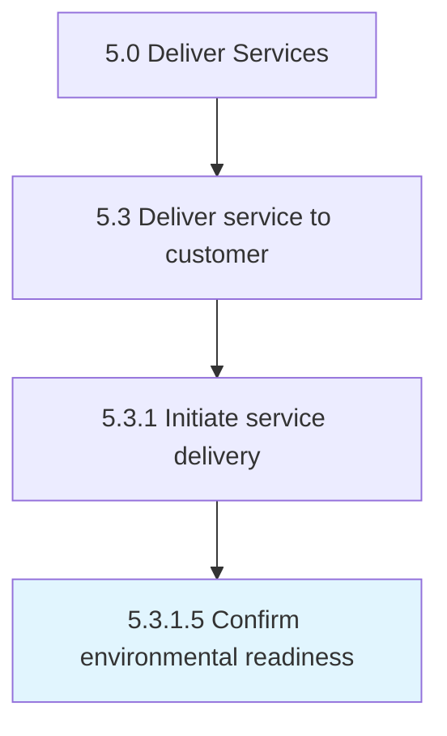

# Confirm environmental readiness

> Confirming that the organization has the recourses necessary to meet the expectations for the solution for service delivery.

## Overview

Activity 5.3.1.5 is an activity within the Deliver Services framework. 

Confirming that the organization has the recourses necessary to meet the expectations for the solution for service delivery.

## Process Hierarchy



## Key Statistics

| Metric | Value |
|--------|-------|
| APQC Code | 20064 |
| Hierarchy ID | 5.3.1.5 |
| Level | Activity |
| Parent | [5.3.1](../) |
| Sub-Processes | 0 |


## GraphDL Semantic Structure

```
confirm.EnvironmentalReadiness
```

| Component | Value | Description |
|-----------|-------|-------------|
| Verb | `confirm` | Primary action |
| Object | `environmental readiness` | Direct object |


## Related Concepts

- [EnvironmentalReadiness](/concepts/EnvironmentalReadiness)


---

*Source: APQC PCF 20064 (5.3.1.5) - APQC*
