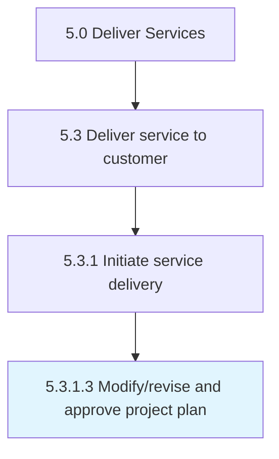

# Modify/revise and approve project plan

> Updating the project plan to align with the new solution approach agreed upon with the customer.

## Overview

Activity 5.3.1.3 is an activity within the Deliver Services framework. 

Updating the project plan to align with the new solution approach agreed upon with the customer.

## Process Hierarchy



## Key Statistics

| Metric | Value |
|--------|-------|
| APQC Code | 20062 |
| Hierarchy ID | 5.3.1.3 |
| Level | Activity |
| Parent | [5.3.1](../) |
| Sub-Processes | 0 |


## GraphDL Semantic Structure

```
modify/revise.AndApproveProjectPlan
```

| Component | Value | Description |
|-----------|-------|-------------|
| Verb | `modify/revise` | Primary action |
| Object | `and approve project plan` | Direct object |


## Related Concepts

- [ApproveProjectPlan](/concepts/ApproveProjectPlan)
- [ApproveProjectPlan](/concepts/ApproveProjectPlan)


---

*Source: APQC PCF 20062 (5.3.1.3) - APQC*
