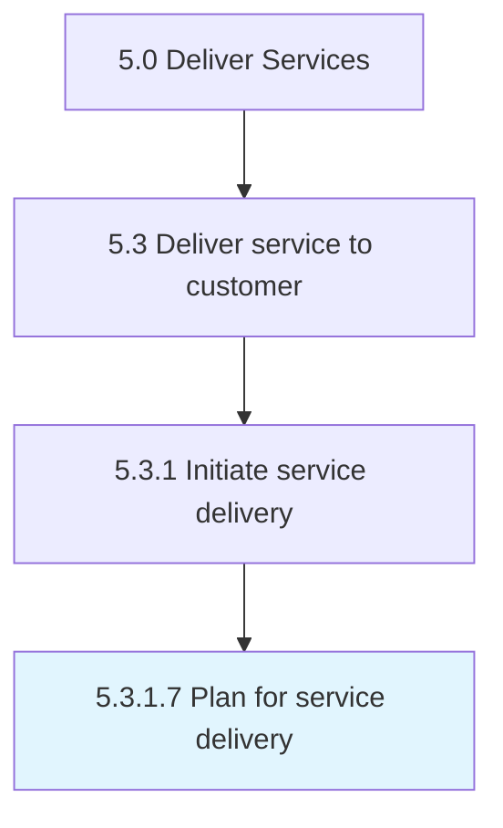

# Plan for service delivery

> Establishing a plan of action to successfully render a solution for service delivery.

## Overview

Activity 5.3.1.7 is an activity within the Deliver Services framework. 

Establishing a plan of action to successfully render a solution for service delivery.

## Process Hierarchy



## Key Statistics

| Metric | Value |
|--------|-------|
| APQC Code | 20068 |
| Hierarchy ID | 5.3.1.7 |
| Level | Activity |
| Parent | [5.3.1](../) |
| Sub-Processes | 0 |


## GraphDL Semantic Structure

```
plan.ForServiceDelivery
```

| Component | Value | Description |
|-----------|-------|-------------|
| Verb | `plan` | Primary action |
| Object | `for service delivery` | Direct object |


## Related Concepts

- [ServiceDelivery](/concepts/ServiceDelivery)


---

*Source: APQC PCF 20068 (5.3.1.7) - APQC*
