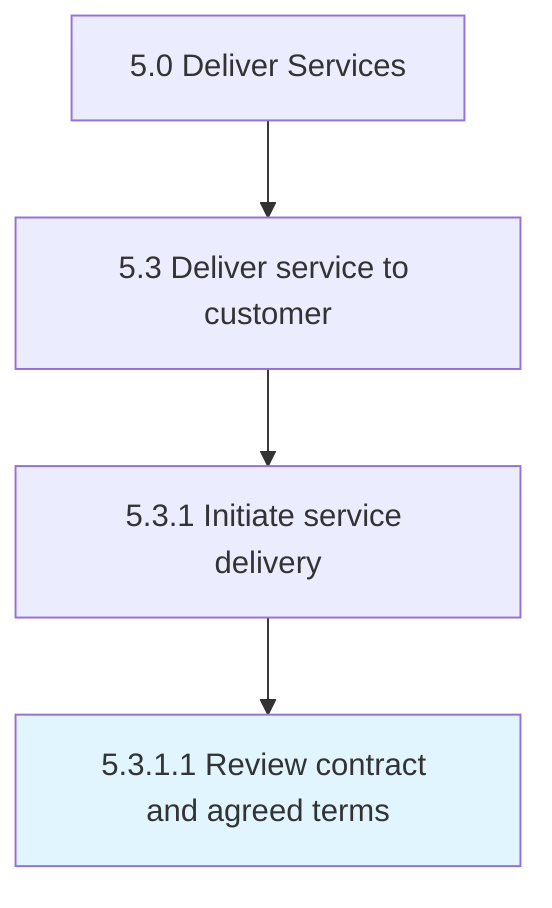

# Review contract and agreed terms

> Meeting with the customer, partner, and/or supplier to review the terms of the solutions contract and agree on the terms set forth.

## Overview

Activity 5.3.1.1 is an activity within the Deliver Services framework. 

Meeting with the customer, partner, and/or supplier to review the terms of the solutions contract and agree on the terms set forth.

## Process Hierarchy



## Key Statistics

| Metric | Value |
|--------|-------|
| APQC Code | 20060 |
| Hierarchy ID | 5.3.1.1 |
| Level | Activity |
| Parent | [5.3.1](../) |
| Sub-Processes | 0 |


## GraphDL Semantic Structure

```
review.ContractAndAgreedTerms
```

| Component | Value | Description |
|-----------|-------|-------------|
| Verb | `review` | Primary action |
| Object | `contract and agreed terms` | Direct object |


## Related Concepts

- ContractTerms
- AgreedTerms


---

*Source: APQC PCF 20060 (5.3.1.1) - APQC*
