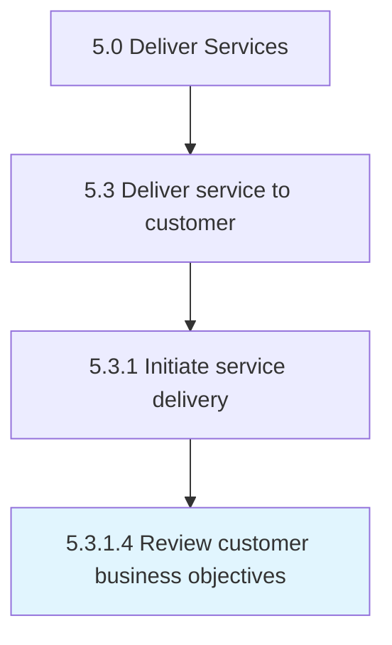

# Review customer business objectives

> Aligning the customer business objectives with the agreed service delivery solution.

## Overview

Activity 5.3.1.4 is an activity within the Deliver Services framework. 

Aligning the customer business objectives with the agreed service delivery solution.

## Process Hierarchy



## Key Statistics

| Metric | Value |
|--------|-------|
| APQC Code | 20063 |
| Hierarchy ID | 5.3.1.4 |
| Level | Activity |
| Parent | [5.3.1](../) |
| Sub-Processes | 0 |


## GraphDL Semantic Structure

```
review.CustomerBusinessObjectives
```

| Component | Value | Description |
|-----------|-------|-------------|
| Verb | `review` | Primary action |
| Object | `customer business objectives` | Direct object |


## Related Concepts

- CustomerBusinessObjectives


---

*Source: APQC PCF 20063 (5.3.1.4) - APQC*
