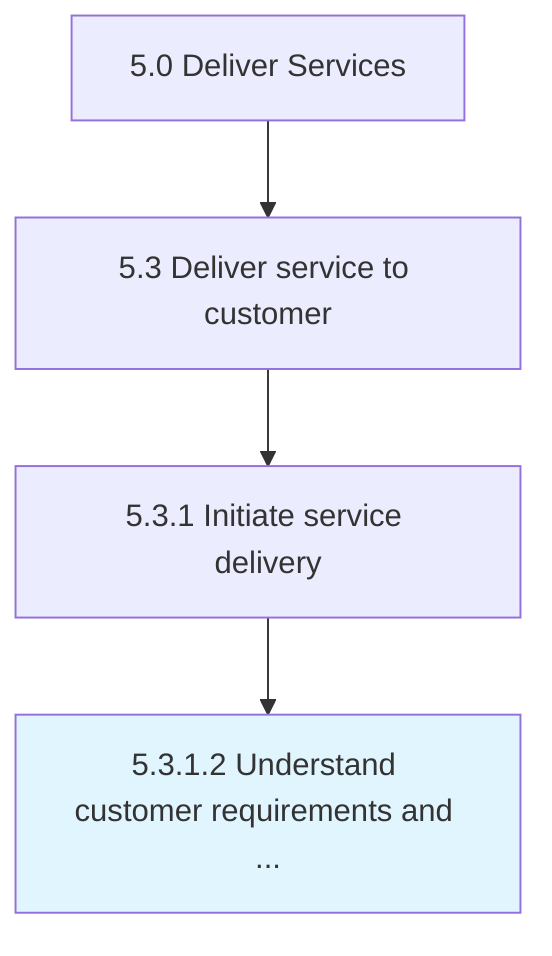

# Understand customer requirements and define refine approach

> Taking the customer requirements for a solution and applying those requirements to a refined approach for service.

## Overview

Activity 5.3.1.2 is an activity within the Deliver Services framework. 

Taking the customer requirements for a solution and applying those requirements to a refined approach for service.

## Process Hierarchy



## Key Statistics

| Metric | Value |
|--------|-------|
| APQC Code | 20061 |
| Hierarchy ID | 5.3.1.2 |
| Level | Activity |
| Parent | [5.3.1](../) |
| Sub-Processes | 0 |


## GraphDL Semantic Structure

```
understand.CustomerRequirementsAndDefineRefineApproach
```

| Component | Value | Description |
|-----------|-------|-------------|
| Verb | `understand` | Primary action |
| Object | `customer requirements and define refine approach` | Direct object |


## Related Concepts

- [CustomerRequirements](/concepts/CustomerRequirements)
- [DefineRefineApproach](/concepts/DefineRefineApproach)


---

*Source: APQC PCF 20061 (5.3.1.2) - APQC*
