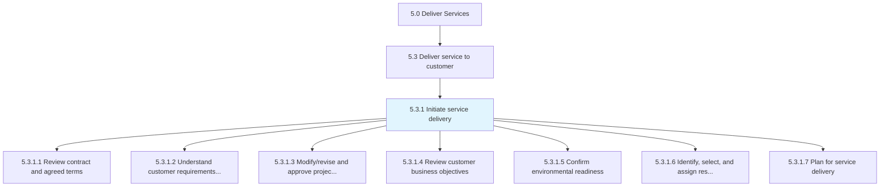
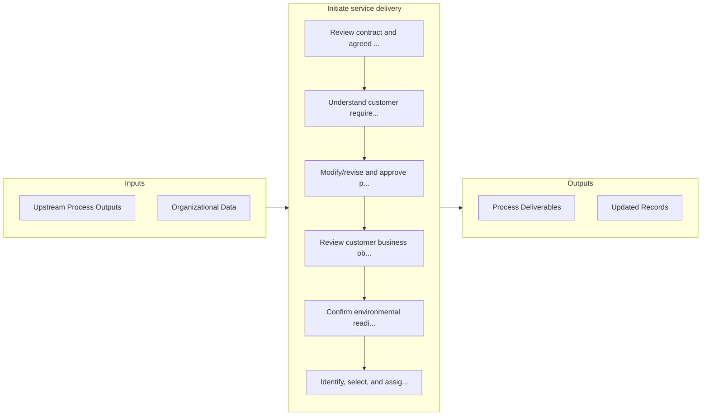

# Initiate service delivery

> Collaborating with the customer to understand service needs.

## Overview

Process 5.3.1 is a core process that defines the specific procedures for initiate service delivery. 

Collaborating with the customer to understand service needs. Review, understand, and modify the delivery scope with the organization needs of the customer in mind. Confirm readiness and identify, select, and assign resources. Plan for service delivery.

## Process Hierarchy



## Key Statistics

| Metric | Value |
|--------|-------|
| APQC Code | 20059 |
| Hierarchy ID | 5.3.1 |
| Level | Process |
| Parent | [5.3](../) |
| Sub-Processes | 7 |


## GraphDL Semantic Structure

```
initiate.ServiceDelivery
```

| Component | Value | Description |
|-----------|-------|-------------|
| Verb | `initiate` | Primary action |
| Object | `service delivery` | Direct object |


## Process Flow



## Sub-Processes

| Process | Hierarchy ID | Description |
|---------|-------------|-------------|
| [Review contract and agreed terms](./ReviewContractAndAgreedTerms) | 5.3.1.1 | Meeting with the customer, partner, and/or supplier to review the terms of the solutions contract an |
| [Understand customer requirements and define refine approach](./UnderstandCustomerRequirementsAndDefineRefineApproach) | 5.3.1.2 | Taking the customer requirements for a solution and applying those requirements to a refined approac |
| [Modify/revise and approve project plan](./ModifyreviseAndApproveProjectPlan) | 5.3.1.3 | Updating the project plan to align with the new solution approach agreed upon with the customer |
| [Review customer business objectives](./ReviewCustomerBusinessObjectives) | 5.3.1.4 | Aligning the customer business objectives with the agreed service delivery solution |
| [Confirm environmental readiness](./ConfirmEnvironmentalReadiness) | 5.3.1.5 | Confirming that the organization has the recourses necessary to meet the expectations for the soluti |
| [Identify, select, and assign resources](./5.3.1.6-IdentifySelectAssignResources/) | 5.3.1.6 | Identifying, selecting, and assigning resources required to deliver service to the customer |
| [Plan for service delivery](./PlanForServiceDelivery) | 5.3.1.7 | Establishing a plan of action to successfully render a solution for service delivery |


## Related Concepts

- [ServiceDelivery](/concepts/ServiceDelivery)


---

*Source: APQC PCF 20059 (5.3.1) - APQC*
