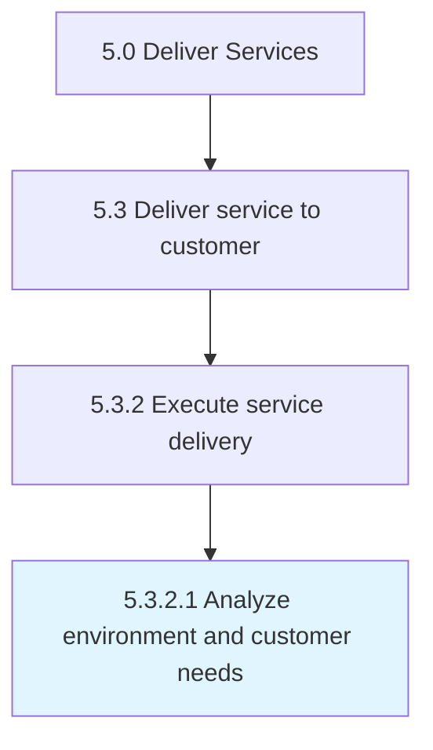

# Analyze environment and customer needs

> Understanding the needs of the customer and providing the necessary resources to meet those requirements within the scope of the organization.

## Overview

Activity 5.3.2.1 is an activity within the Deliver Services framework. 

Understanding the needs of the customer and providing the necessary resources to meet those requirements within the scope of the organization.

## Process Hierarchy



## Key Statistics

| Metric | Value |
|--------|-------|
| APQC Code | 20070 |
| Hierarchy ID | 5.3.2.1 |
| Level | Activity |
| Parent | [5.3.2](../) |
| Sub-Processes | 0 |


## GraphDL Semantic Structure

```
analyze.EnvironmentAndCustomerNeeds
```

| Component | Value | Description |
|-----------|-------|-------------|
| Verb | `analyze` | Primary action |
| Object | `environment and customer needs` | Direct object |


## Related Concepts

- [Environment](/concepts/Environment)
- [CustomerNeeds](/concepts/CustomerNeeds)


---

*Source: APQC PCF 20070 (5.3.2.1) - APQC*
