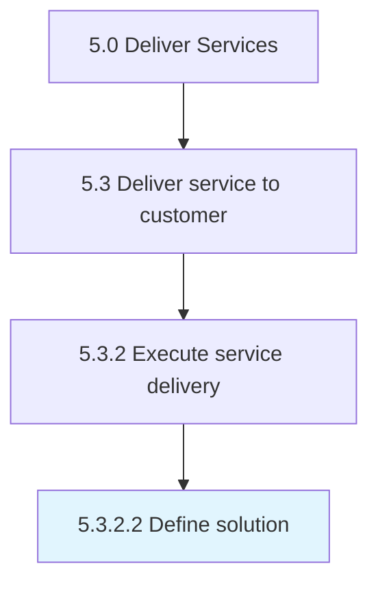

# Define solution

> Creating a plan of action to provide service delivery to the customer through a possible solution.

## Overview

Activity 5.3.2.2 is an activity within the Deliver Services framework. 

Creating a plan of action to provide service delivery to the customer through a possible solution. This solution should be in response to a collaborative effort made by the organization and the customer to meet service delivery needs.

## Process Hierarchy



## Key Statistics

| Metric | Value |
|--------|-------|
| APQC Code | 20071 |
| Hierarchy ID | 5.3.2.2 |
| Level | Activity |
| Parent | [5.3.2](../) |
| Sub-Processes | 0 |


## GraphDL Semantic Structure

```
define.Solution
```

| Component | Value | Description |
|-----------|-------|-------------|
| Verb | `define` | Primary action |
| Object | `solution` | Direct object |


## Related Concepts

- Solution


---

*Source: APQC PCF 20071 (5.3.2.2) - APQC*
