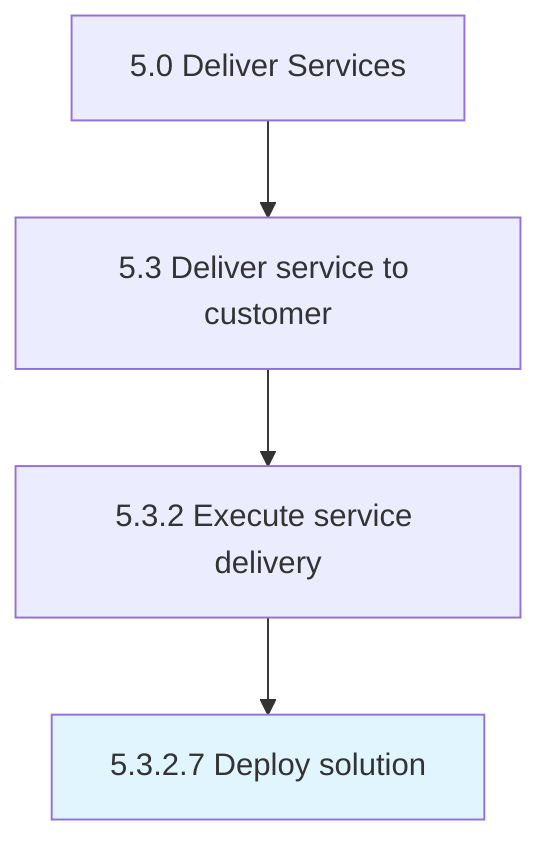

# Deploy solution

> Providing the customer with promised services and solutions.

## Overview

Activity 5.3.2.7 is an activity within the Deliver Services framework. 

Providing the customer with promised services and solutions.

## Process Hierarchy



## Key Statistics

| Metric | Value |
|--------|-------|
| APQC Code | 20076 |
| Hierarchy ID | 5.3.2.7 |
| Level | Activity |
| Parent | [5.3.2](../) |
| Sub-Processes | 0 |


## GraphDL Semantic Structure

```
deploy.Solution
```

| Component | Value | Description |
|-----------|-------|-------------|
| Verb | `deploy` | Primary action |
| Object | `solution` | Direct object |


## Related Concepts

- [Solution](/concepts/Solution)


---

*Source: APQC PCF 20076 (5.3.2.7) - APQC*
