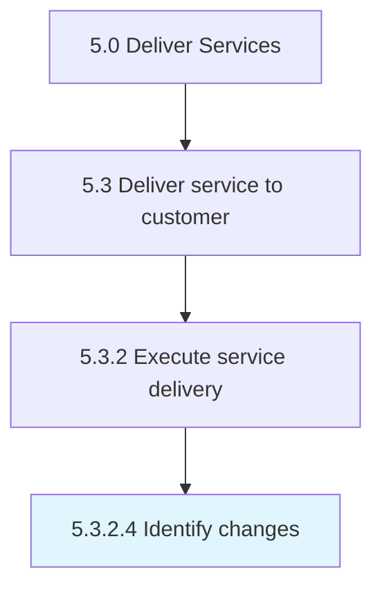

# Identify changes

> Realizing issues within the original drafted solution and providing changes to correct those issues.

## Overview

Activity 5.3.2.4 is an activity within the Deliver Services framework. 

Realizing issues within the original drafted solution and providing changes to correct those issues.

## Process Hierarchy



## Key Statistics

| Metric | Value |
|--------|-------|
| APQC Code | 20073 |
| Hierarchy ID | 5.3.2.4 |
| Level | Activity |
| Parent | [5.3.2](../) |
| Sub-Processes | 0 |


## GraphDL Semantic Structure

```
identify.Changes
```

| Component | Value | Description |
|-----------|-------|-------------|
| Verb | `identify` | Primary action |
| Object | `changes` | Direct object |


## Related Concepts

- [Changes](/concepts/Changes)


---

*Source: APQC PCF 20073 (5.3.2.4) - APQC*
