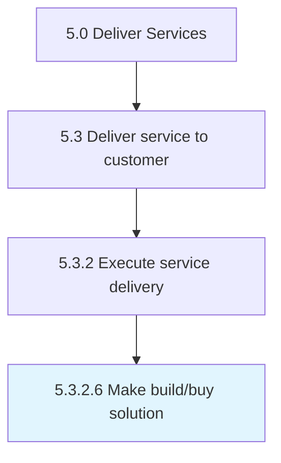

# Make build/buy solution

> Constructing or purchasing solutions necessary to provide service delivery.

## Overview

Activity 5.3.2.6 is an activity within the Deliver Services framework. 

Constructing or purchasing solutions necessary to provide service delivery.

## Process Hierarchy



## Key Statistics

| Metric | Value |
|--------|-------|
| APQC Code | 20075 |
| Hierarchy ID | 5.3.2.6 |
| Level | Activity |
| Parent | [5.3.2](../) |
| Sub-Processes | 0 |


## GraphDL Semantic Structure

```
make.BuildbuySolution
```

| Component | Value | Description |
|-----------|-------|-------------|
| Verb | `make` | Primary action |
| Object | `build/buy solution` | Direct object |


## Related Concepts

- [BuildSolution](/concepts/BuildSolution)
- [BuySolution](/concepts/BuySolution)


---

*Source: APQC PCF 20075 (5.3.2.6) - APQC*
