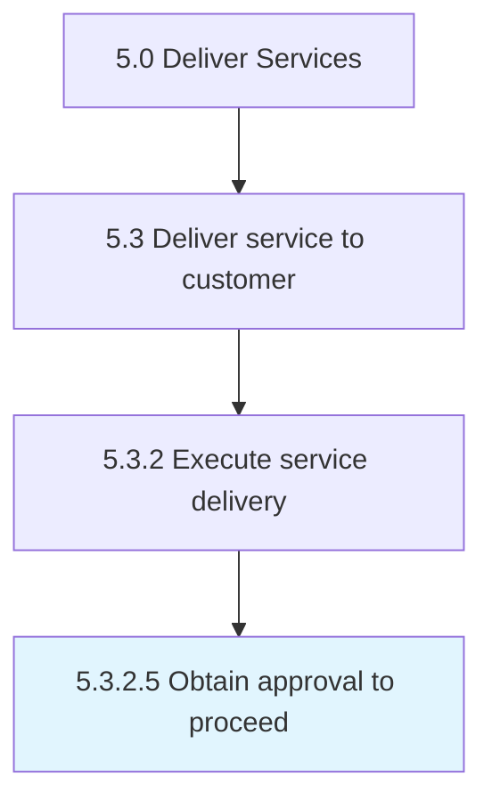

# Obtain approval to proceed

> Gaining approval from all avenues to proceed with providing solutions for service delivery.

## Overview

Activity 5.3.2.5 is an activity within the Deliver Services framework. 

Gaining approval from all avenues to proceed with providing solutions for service delivery.

## Process Hierarchy



## Key Statistics

| Metric | Value |
|--------|-------|
| APQC Code | 20074 |
| Hierarchy ID | 5.3.2.5 |
| Level | Activity |
| Parent | [5.3.2](../) |
| Sub-Processes | 0 |


## GraphDL Semantic Structure

```
obtain.Approval.to.Proceed
```

| Component | Value | Description |
|-----------|-------|-------------|
| Verb | `obtain` | Primary action |
| Object | `approval` | Direct object |
| Preposition | `to` | Relationship |
| PrepObject | `proceed` | Indirect object |


## Related Concepts

- [Approval](/concepts/Approval)
- [Proceed](/concepts/Proceed)


---

*Source: APQC PCF 20074 (5.3.2.5) - APQC*
