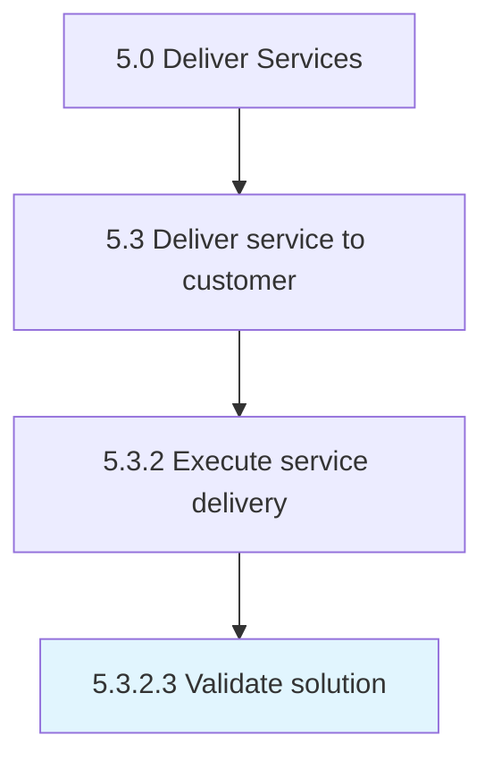

# Validate solution

> Validating that the proposed solution is feasible and provides the needed services for the customer.

## Overview

Activity 5.3.2.3 is an activity within the Deliver Services framework. 

Validating that the proposed solution is feasible and provides the needed services for the customer.

## Process Hierarchy



## Key Statistics

| Metric | Value |
|--------|-------|
| APQC Code | 20072 |
| Hierarchy ID | 5.3.2.3 |
| Level | Activity |
| Parent | [5.3.2](../) |
| Sub-Processes | 0 |


## GraphDL Semantic Structure

```
validate.Solution
```

| Component | Value | Description |
|-----------|-------|-------------|
| Verb | `validate` | Primary action |
| Object | `solution` | Direct object |


## Related Concepts

- Solution


---

*Source: APQC PCF 20072 (5.3.2.3) - APQC*
