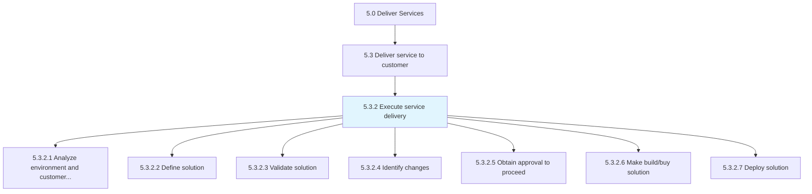
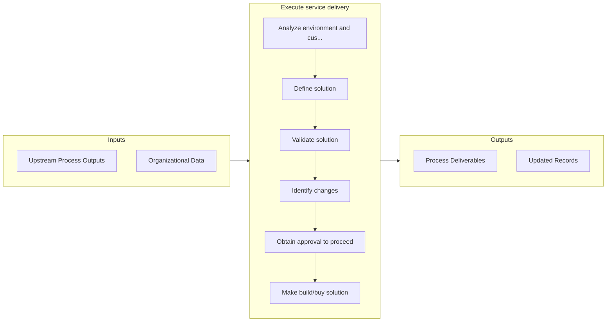

# Execute service delivery

> Carrying out service delivery to the customer by creating and deploying the necessary solution.

## Overview

Process 5.3.2 is a core process that defines the specific procedures for execute service delivery. 

Carrying out service delivery to the customer by creating and deploying the necessary solution. Analyze need and create a solution. Validate the solution and make changes if needed. Obtain approval to build/buy solution and then deploy solution to customer.

## Process Hierarchy



## Key Statistics

| Metric | Value |
|--------|-------|
| APQC Code | 20069 |
| Hierarchy ID | 5.3.2 |
| Level | Process |
| Parent | [5.3](../) |
| Sub-Processes | 7 |


## GraphDL Semantic Structure

```
execute.ServiceDelivery
```

| Component | Value | Description |
|-----------|-------|-------------|
| Verb | `execute` | Primary action |
| Object | `service delivery` | Direct object |


## Process Flow



## Sub-Processes

| Process | Hierarchy ID | Description |
|---------|-------------|-------------|
| [Analyze environment and customer needs](./AnalyzeEnvironmentAndCustomerNeeds) | 5.3.2.1 | Understanding the needs of the customer and providing the necessary resources to meet those requirem |
| [Define solution](./DefineSolution) | 5.3.2.2 | Creating a plan of action to provide service delivery to the customer through a possible solution |
| [Validate solution](./ValidateSolution) | 5.3.2.3 | Validating that the proposed solution is feasible and provides the needed services for the customer |
| [Identify changes](./IdentifyChanges) | 5.3.2.4 | Realizing issues within the original drafted solution and providing changes to correct those issues |
| [Obtain approval to proceed](./ObtainApprovalToProceed) | 5.3.2.5 | Gaining approval from all avenues to proceed with providing solutions for service delivery |
| [Make build/buy solution](./MakeBuildbuySolution) | 5.3.2.6 | Constructing or purchasing solutions necessary to provide service delivery |
| [Deploy solution](./DeploySolution) | 5.3.2.7 | Providing the customer with promised services and solutions |


## Related Concepts

- ServiceDelivery


---

*Source: APQC PCF 20069 (5.3.2) - APQC*
