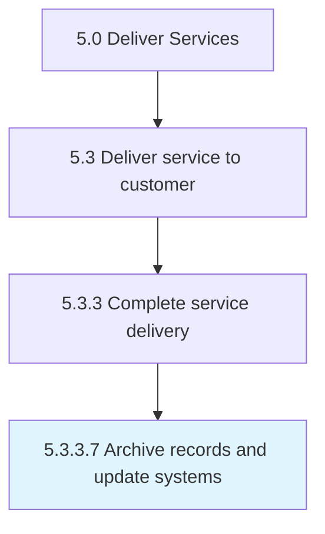

# Archive records and update systems

> Completing and archiving all records associated with requested services.

## Overview

Activity 5.3.3.7 is an activity within the Deliver Services framework. 

Completing and archiving all records associated with requested services. Update all necessary systems to reflect those changes.

## Process Hierarchy



## Key Statistics

| Metric | Value |
|--------|-------|
| APQC Code | 20084 |
| Hierarchy ID | 5.3.3.7 |
| Level | Activity |
| Parent | [5.3.3](../) |
| Sub-Processes | 0 |


## GraphDL Semantic Structure

```
archive.RecordsAndUpdateSystems
```

| Component | Value | Description |
|-----------|-------|-------------|
| Verb | `archive` | Primary action |
| Object | `records and update systems` | Direct object |


## Related Concepts

- [RecordsSystems](/concepts/RecordsSystems)
- [UpdateSystems](/concepts/UpdateSystems)


---

*Source: APQC PCF 20084 (5.3.3.7) - APQC*
