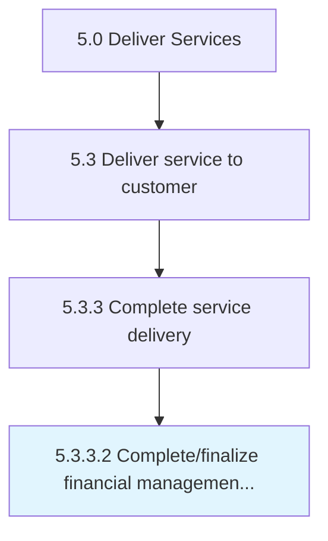

# Complete/finalize financial management activities

> Insuring all payments are received and all activates therein are completed.

## Overview

Activity 5.3.3.2 is an activity within the Deliver Services framework. 

Insuring all payments are received and all activates therein are completed.

## Process Hierarchy



## Key Statistics

| Metric | Value |
|--------|-------|
| APQC Code | 20079 |
| Hierarchy ID | 5.3.3.2 |
| Level | Activity |
| Parent | [5.3.3](../) |
| Sub-Processes | 0 |


## GraphDL Semantic Structure

```
complete/finalize.FinancialManagementActivities
```

| Component | Value | Description |
|-----------|-------|-------------|
| Verb | `complete/finalize` | Primary action |
| Object | `financial management activities` | Direct object |


## Related Concepts

- [FinancialManagementActivities](/concepts/FinancialManagementActivities)
- [FinancialManagementActivities](/concepts/FinancialManagementActivities)


---

*Source: APQC PCF 20079 (5.3.3.2) - APQC*
