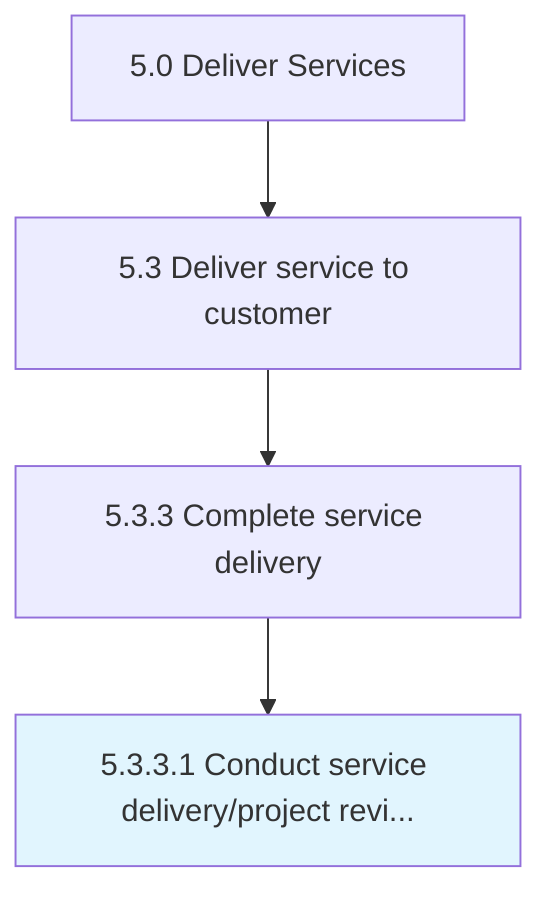

# Conduct service delivery/project review and evaluate success

> Reviewing the entire service delivery process to evaluate the success of the project from beginning to end.

## Overview

Activity 5.3.3.1 is an activity within the Deliver Services framework. 

Reviewing the entire service delivery process to evaluate the success of the project from beginning to end.

## Process Hierarchy



## Key Statistics

| Metric | Value |
|--------|-------|
| APQC Code | 20078 |
| Hierarchy ID | 5.3.3.1 |
| Level | Activity |
| Parent | [5.3.3](../) |
| Sub-Processes | 0 |


## GraphDL Semantic Structure

```
conduct.ServiceDeliveryprojectReviewAndEvaluateSuccess
```

| Component | Value | Description |
|-----------|-------|-------------|
| Verb | `conduct` | Primary action |
| Object | `service delivery/project review and evaluate success` | Direct object |


## Related Concepts

- [ServiceDeliveryReview](/concepts/ServiceDeliveryReview)
- [ServiceProjectReview](/concepts/ServiceProjectReview)
- [EvaluateSuccess](/concepts/EvaluateSuccess)


---

*Source: APQC PCF 20078 (5.3.3.1) - APQC*
