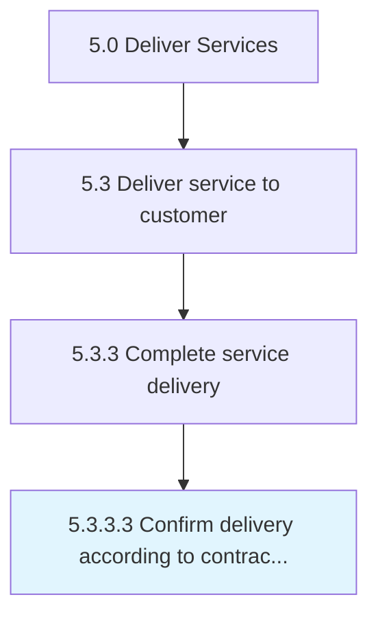

# Confirm delivery according to contract terms

> Confirming that the organization has satisfied all terms of the delivery contract set forth in collaboration between the organization and customer.

## Overview

Activity 5.3.3.3 is an activity within the Deliver Services framework. 

Confirming that the organization has satisfied all terms of the delivery contract set forth in collaboration between the organization and customer.

## Process Hierarchy



## Key Statistics

| Metric | Value |
|--------|-------|
| APQC Code | 20080 |
| Hierarchy ID | 5.3.3.3 |
| Level | Activity |
| Parent | [5.3.3](../) |
| Sub-Processes | 0 |


## GraphDL Semantic Structure

```
confirm.DeliveryAccording.to.ContractTerms
```

| Component | Value | Description |
|-----------|-------|-------------|
| Verb | `confirm` | Primary action |
| Object | `delivery according` | Direct object |
| Preposition | `to` | Relationship |
| PrepObject | `contract terms` | Indirect object |


## Related Concepts

- [DeliveryAccording](/concepts/DeliveryAccording)
- [ContractTerms](/concepts/ContractTerms)


---

*Source: APQC PCF 20080 (5.3.3.3) - APQC*
