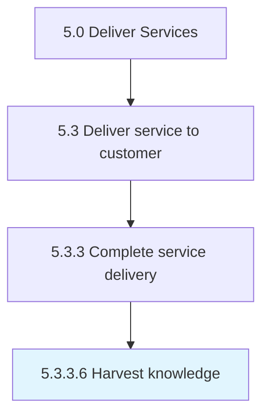

# Harvest knowledge

> Garnering feedback from all avenues to collect a knowledge base concerning services rendered.

## Overview

Activity 5.3.3.6 is an activity within the Deliver Services framework. 

Garnering feedback from all avenues to collect a knowledge base concerning services rendered.

## Process Hierarchy



## Key Statistics

| Metric | Value |
|--------|-------|
| APQC Code | 20083 |
| Hierarchy ID | 5.3.3.6 |
| Level | Activity |
| Parent | [5.3.3](../) |
| Sub-Processes | 0 |


## GraphDL Semantic Structure

```
harvest.Knowledge
```

| Component | Value | Description |
|-----------|-------|-------------|
| Verb | `harvest` | Primary action |
| Object | `knowledge` | Direct object |


## Related Concepts

- [Knowledge](/concepts/Knowledge)


---

*Source: APQC PCF 20083 (5.3.3.6) - APQC*
