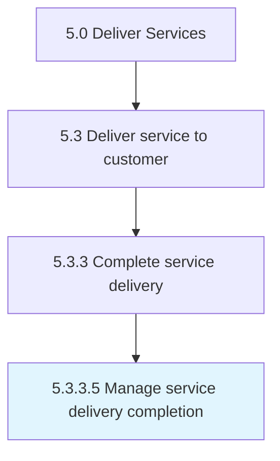

# Manage service delivery completion

> Ensuring that all aspects of the service delivery process are completed both internally and externally.

## Overview

Activity 5.3.3.5 is an activity within the Deliver Services framework. 

Ensuring that all aspects of the service delivery process are completed both internally and externally.

## Process Hierarchy



## Key Statistics

| Metric | Value |
|--------|-------|
| APQC Code | 20082 |
| Hierarchy ID | 5.3.3.5 |
| Level | Activity |
| Parent | [5.3.3](../) |
| Sub-Processes | 0 |


## GraphDL Semantic Structure

```
manage.ServiceDeliveryCompletion
```

| Component | Value | Description |
|-----------|-------|-------------|
| Verb | `manage` | Primary action |
| Object | `service delivery completion` | Direct object |


## Related Concepts

- [ServiceDeliveryCompletion](/concepts/ServiceDeliveryCompletion)


---

*Source: APQC PCF 20082 (5.3.3.5) - APQC*
