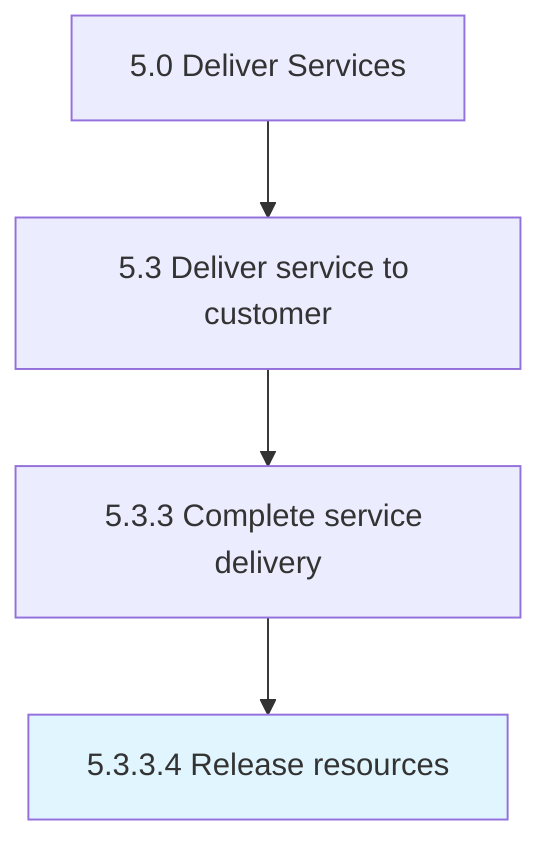

# Release resources

> Discharging leveraged resources from service delivery commitments upon completion.

## Overview

Activity 5.3.3.4 is an activity within the Deliver Services framework. 

Discharging leveraged resources from service delivery commitments upon completion. Returning resources to the resource pool.

## Process Hierarchy



## Key Statistics

| Metric | Value |
|--------|-------|
| APQC Code | 20081 |
| Hierarchy ID | 5.3.3.4 |
| Level | Activity |
| Parent | [5.3.3](../) |
| Sub-Processes | 0 |


## GraphDL Semantic Structure

```
release.Resources
```

| Component | Value | Description |
|-----------|-------|-------------|
| Verb | `release` | Primary action |
| Object | `resources` | Direct object |


## Related Concepts

- [Resources](/concepts/Resources)


---

*Source: APQC PCF 20081 (5.3.3.4) - APQC*
