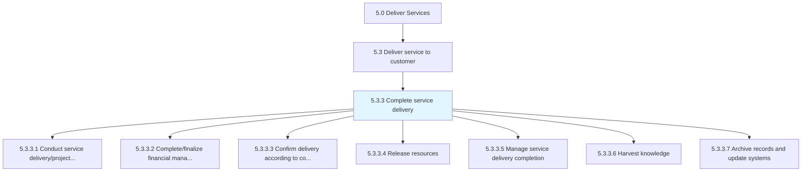
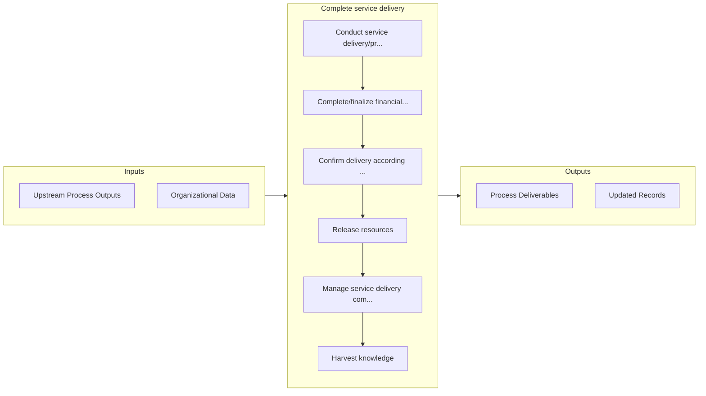

# Complete service delivery

> Implementing final steps to complete service delivery to the customer.

## Overview

Process 5.3.3 is a core process that defines the specific procedures for complete service delivery. 

Implementing final steps to complete service delivery to the customer. Evaluate success through project review, complete finance activities, and confirm delivery. Release resources and manage completion by harvesting knowledge and systems by archiving records.

## Process Hierarchy



## Key Statistics

| Metric | Value |
|--------|-------|
| APQC Code | 20077 |
| Hierarchy ID | 5.3.3 |
| Level | Process |
| Parent | [5.3](../) |
| Sub-Processes | 7 |


## GraphDL Semantic Structure

```
complete.ServiceDelivery
```

| Component | Value | Description |
|-----------|-------|-------------|
| Verb | `complete` | Primary action |
| Object | `service delivery` | Direct object |


## Process Flow



## Sub-Processes

| Process | Hierarchy ID | Description |
|---------|-------------|-------------|
| [Conduct service delivery/project review and evaluate success](./ConductServiceDeliveryprojectReviewAndEvaluateSuccess) | 5.3.3.1 | Reviewing the entire service delivery process to evaluate the success of the project from beginning  |
| [Complete/finalize financial management activities](./CompletefinalizeFinancialManagementActivities) | 5.3.3.2 | Insuring all payments are received and all activates therein are completed |
| [Confirm delivery according to contract terms](./ConfirmDeliveryAccordingToContractTerms) | 5.3.3.3 | Confirming that the organization has satisfied all terms of the delivery contract set forth in colla |
| [Release resources](./ReleaseResources) | 5.3.3.4 | Discharging leveraged resources from service delivery commitments upon completion |
| [Manage service delivery completion](./ManageServiceDeliveryCompletion) | 5.3.3.5 | Ensuring that all aspects of the service delivery process are completed both internally and external |
| [Harvest knowledge](./HarvestKnowledge) | 5.3.3.6 | Garnering feedback from all avenues to collect a knowledge base concerning services rendered |
| [Archive records and update systems](./ArchiveRecordsAndUpdateSystems) | 5.3.3.7 | Completing and archiving all records associated with requested services |


## Related Concepts

- [ServiceDelivery](/concepts/ServiceDelivery)


---

*Source: APQC PCF 20077 (5.3.3) - APQC*
