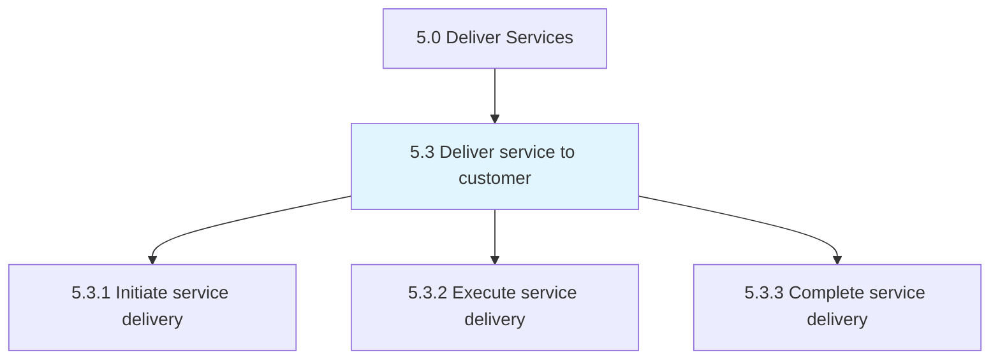
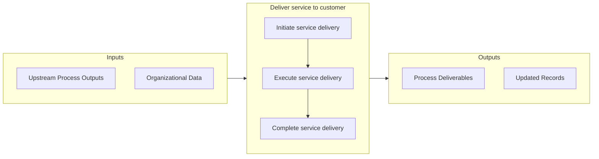

# Deliver service to customer

> Rendering service to the customer by initiating, executing, and completing tasks associated with service delivery.

## Overview

Group 5.3 is a process group within APQC Category 5.0 (Deliver Services). 

Rendering service to the customer by initiating, executing, and completing tasks associated with service delivery.

## Process Hierarchy



## Key Statistics

| Metric | Value |
|--------|-------|
| APQC Code | 20058 |
| Hierarchy ID | 5.3 |
| Level | Group |
| Parent | [5](../) |
| Sub-Processes | 3 |


## GraphDL Semantic Structure

```graphdl
deliver.Service.to.Customer
```

| Component | Value | Description |
|-----------|-------|-------------|
| Verb | `deliver` | Primary action |
| Object | `service` | Direct object |
| Preposition | `to` | Relationship |
| PrepObject | `customer` | Indirect object |


## Process Flow



## Sub-Processes

| Process | Hierarchy ID | Description |
|---------|-------------|-------------|
| [Initiate service delivery](./5.3.1-InitiateServiceDelivery/) | 5.3.1 | Collaborating with the customer to understand service needs |
| [Execute service delivery](./5.3.2-ExecuteServiceDelivery/) | 5.3.2 | Carrying out service delivery to the customer by creating and deploying the necessary solution |
| [Complete service delivery](./5.3.3-CompleteServiceDelivery/) | 5.3.3 | Implementing final steps to complete service delivery to the customer |


## Related Concepts

- Service
- Customer


---

*Source: APQC PCF 20058 (5.3) - APQC*
