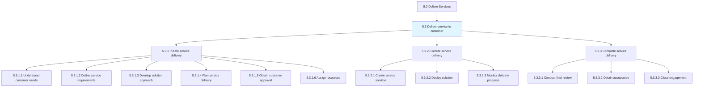
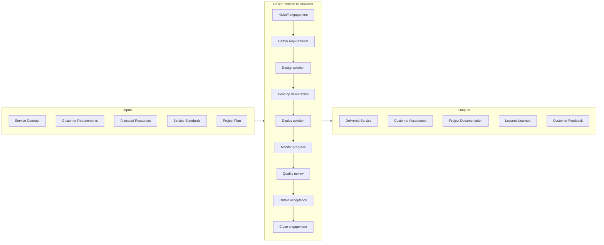
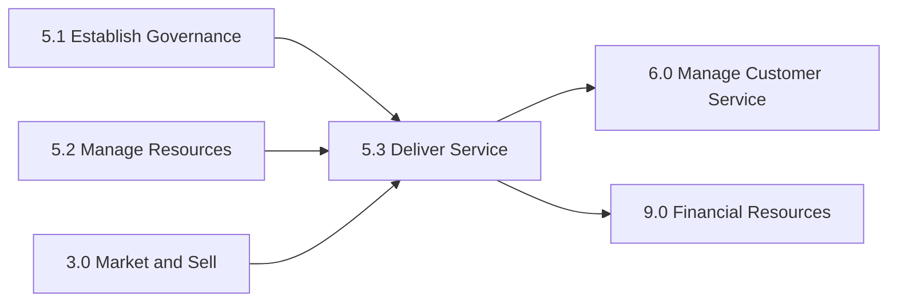

# Deliver service to customer

> Rendering service to the customer by initiating, executing, and completing tasks associated with service delivery.

## Overview

Group 5.3 is a process group within APQC Category 5.0 (Deliver Services). This is the core operational process group where services are actually delivered to customers, representing the execution phase of the service delivery lifecycle.

Rendering service to the customer by initiating, executing, and completing tasks associated with service delivery. This process group encompasses the entire customer-facing service journey from initial engagement through final delivery and closeout. It includes understanding customer requirements, developing and deploying solutions, managing ongoing service activities, and ensuring successful completion with customer acceptance.

Effective service delivery requires close coordination between front-line service staff, project managers, subject matter experts, and support teams. The quality of execution in this process group directly determines customer satisfaction, retention, and referral potential.

## Process Hierarchy



## Key Statistics

| Metric | Value |
|--------|-------|
| APQC Code | 20058 |
| Hierarchy ID | 5.3 |
| Level | Group |
| Parent | [5](../) |
| Sub-Processes | 3 |
| Activities | 12+ |
| Industry Variants | 19 |

## GraphDL Semantic Structure

```graphdl
deliver.Service.to.Customer
```

| Component | Value | Description |
|-----------|-------|-------------|
| Verb | `deliver` | Primary action of providing or rendering |
| Object | `service` | The intangible offering being provided |
| Preposition | `to` | Relationship indicating direction/recipient |
| PrepObject | `customer` | The recipient of the service |

## Process Flow



## Child Process Listings

### 5.3.1 - Initiate service delivery

Collaborating with the customer to understand service needs and prepare for execution. This phase establishes the foundation for successful service delivery through clear requirements, agreed scope, and proper resource assignment.

**Key Activities:**
- Conduct customer needs assessment (5.3.1.1)
- Define and document service requirements (5.3.1.2)
- Develop solution approach and methodology (5.3.1.3)
- Create detailed service delivery plan (5.3.1.4)
- Obtain customer approval and sign-off (5.3.1.5)
- Identify, select, and assign resources (5.3.1.6)

[View Process Details](./5.3.1-InitiateServiceDelivery/)

### 5.3.2 - Execute service delivery

Carrying out service delivery to the customer by creating and deploying the necessary solution. This is the active work phase where value is created and delivered to the customer.

**Key Activities:**
- Create and develop service solution components
- Deploy solution to customer environment
- Conduct testing and validation
- Manage changes and issues
- Provide status updates and reporting
- Ensure quality throughout delivery

[View Process Details](./5.3.2-ExecuteServiceDelivery/)

### 5.3.3 - Complete service delivery

Implementing final steps to complete service delivery to the customer. This phase ensures proper closure with customer acceptance and knowledge transfer.

**Key Activities:**
- Conduct final quality review and testing
- Obtain formal customer acceptance
- Complete knowledge transfer and training
- Document lessons learned
- Archive project documentation
- Transition to ongoing support (if applicable)

[View Process Details](./5.3.3-CompleteServiceDelivery/)

## RACI Matrix

| Activity | Service Delivery Lead | Project Manager | Account Manager | Service Team | Customer | Quality Manager |
|----------|----------------------|-----------------|-----------------|--------------|----------|-----------------|
| Kickoff engagement | R | R | A | I | C | I |
| Gather requirements | R | C | C | R | A | I |
| Design solution | R | C | I | R | C | C |
| Develop deliverables | A | C | I | R | I | C |
| Deploy solution | R | C | I | R | C | C |
| Monitor progress | C | R | C | C | I | I |
| Quality review | C | C | I | C | C | R |
| Obtain acceptance | R | C | A | I | R | I |
| Close engagement | C | R | A | I | C | I |

**Legend:** R = Responsible, A = Accountable, C = Consulted, I = Informed

## Metrics and KPIs

| Metric | Description | Target | Frequency |
|--------|-------------|--------|-----------|
| On-Time Delivery Rate | Percentage of services delivered by agreed date | >95% | Per engagement |
| Customer Satisfaction Score | Post-delivery customer satisfaction rating | >4.5/5.0 | Per engagement |
| First-Time Quality Rate | Percentage of deliverables accepted without rework | >90% | Per engagement |
| Scope Change Rate | Percentage of scope changes after approval | <15% | Per engagement |
| Budget Variance | Actual cost vs. planned budget | +/- 5% | Per engagement |
| Issue Resolution Time | Average time to resolve delivery issues | <24 hours | Per occurrence |
| Customer Acceptance Rate | Percentage of services accepted on first submission | >85% | Per engagement |
| Net Promoter Score | Customer likelihood to recommend | >50 | Quarterly |
| Rework Rate | Percentage of work requiring rework | <10% | Per engagement |
| Resource Efficiency | Actual hours vs. planned hours | +/- 10% | Per engagement |

## Related Departments

- [Operations](/departments/Operations) - Primary service delivery execution
- [Customer Success](/departments/CustomerSuccess) - Customer relationship and satisfaction
- [Project Management Office](/departments/PMO) - Project governance and methodology
- [Quality Assurance](/departments/Quality) - Delivery quality oversight
- [Sales](/departments/Sales) - Customer expectations and contract terms
- [Support Services](/departments/Support) - Post-delivery transition

## Related Occupations

- [Project Management Specialists](/occupations/Business/ProjectManagement/ProjectManagementSpecialists) - Delivery management
- [General and Operations Managers](/occupations/Management/GeneralOperationsManagers) - Service operations oversight
- [Customer Service Representatives](/occupations/Sales/CustomerServiceRepresentatives) - Customer interaction
- [Management Analysts](/occupations/Business/Operations/ManagementAnalysts) - Solution development
- [Business Operations Specialists](/occupations/Business/Operations/BusinessOperationsSpecialists) - Delivery execution
- [Quality Control Analysts](/occupations/Business/Quality/QualityControlAnalysts) - Quality assurance

## Related Concepts

- Service
- Customer
- ServiceDelivery
- ProjectManagement
- QualityAssurance
- CustomerSatisfaction

## Related Processes



---

*Source: APQC PCF 20058 (5.3) - APQC*
