# Develop and maintain delivery service policy

> Establishing rules and regulations, as well as the terms and conditions regarding the delivery of service by the company. Develop a delivery plan that specifies what, how, when, and in which way to deliver services to the customer.

## Overview

Develop and maintain delivery service policy (APQC 4.4.1.4) establishes the foundational rules, standards, and guidelines that govern how an organization delivers services to its customers. While technically part of the Deliver Physical Products category (4.0), this process is equally applicable to service delivery and provides critical policy frameworks that support Category 5.0 processes.

This process encompasses the creation and ongoing maintenance of policies that define service delivery terms and conditions, service level commitments, delivery methods and channels, customer communication standards, escalation procedures, and exception handling. These policies ensure consistency in service delivery across the organization, set clear expectations with customers, and provide employees with guidance for handling various delivery scenarios.

Effective delivery service policies balance customer expectations with operational capabilities, regulatory requirements, and financial considerations. They provide the foundation upon which service delivery strategies are built and operational procedures are designed.

## Process Hierarchy

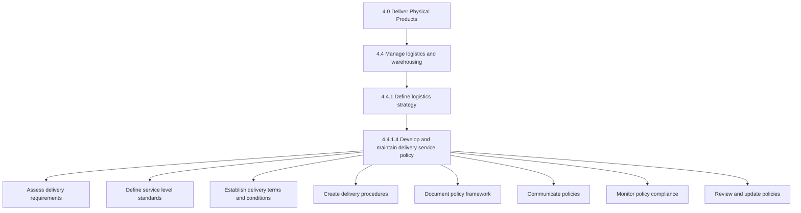

## Key Statistics

| Metric | Value |
|--------|-------|
| APQC Code | 10346 |
| Hierarchy ID | 4.4.1.4 |
| Level | Activity |
| Category | [Deliver Physical Products](/processes/04-Delivery) |
| Related Category | [Deliver Services](/processes/05-Services) |
| Tasks | 8+ |

## Process Flow

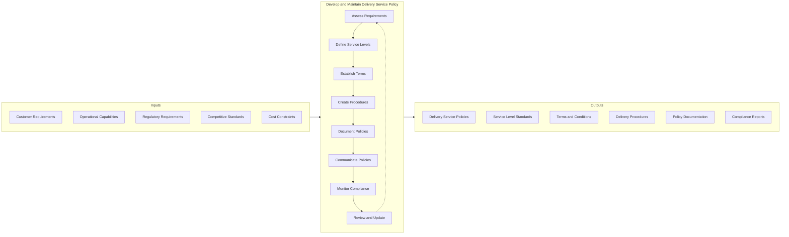

## GraphDL Semantic Structure

```
develop.DeliveryServicePolicy
```

| Component | Value | Description |
|-----------|-------|-------------|
| Verb | `develop` | Primary action of creating and establishing |
| Object | `DeliveryServicePolicy` | Rules and standards for service delivery |
| Preposition | - | Not applicable |
| PrepObject | - | Not applicable |

**Related Semantic Structures:**
- `maintain.DeliveryServicePolicy` - Keep policies current
- `define.ServiceLevelStandards` - Establish performance commitments
- `establish.DeliveryTerms.and.Conditions` - Set contractual requirements
- `create.DeliveryProcedures` - Develop operational guidelines
- `monitor.PolicyCompliance` - Track adherence to policies

## Activities

### Assess delivery requirements

Analyzing customer needs, operational capabilities, regulatory requirements, and competitive standards to understand the parameters within which delivery policies must operate.

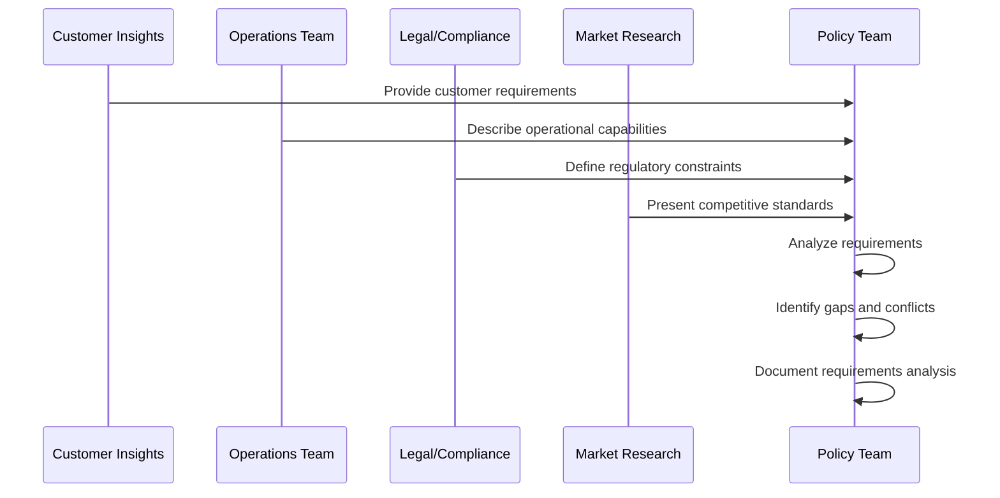

**Tasks:**
- `analyze.CustomerRequirements` - Understand customer delivery expectations
- `assess.OperationalCapabilities` - Evaluate delivery capacity and constraints
- `identify.RegulatoryRequirements` - Document compliance obligations
- `benchmark.CompetitiveStandards` - Assess industry delivery practices
- `reconcile.RequirementConflicts` - Resolve competing requirements

### Define service level standards

Establishing the specific performance commitments and quality standards that will govern service delivery, including timing, quality, and availability metrics.

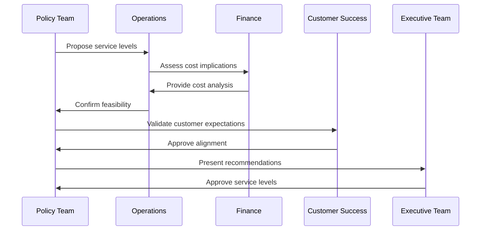

**Tasks:**
- `define.DeliveryTimelines` - Establish delivery time commitments
- `set.QualityStandards` - Define quality requirements
- `establish.AvailabilityTargets` - Set service availability metrics
- `create.ServiceTiers` - Define differentiated service levels
- `validate.ServiceLevels` - Confirm customer and operational alignment

### Establish delivery terms and conditions

Creating the contractual and operational terms that define the relationship between the organization and customers regarding service delivery.

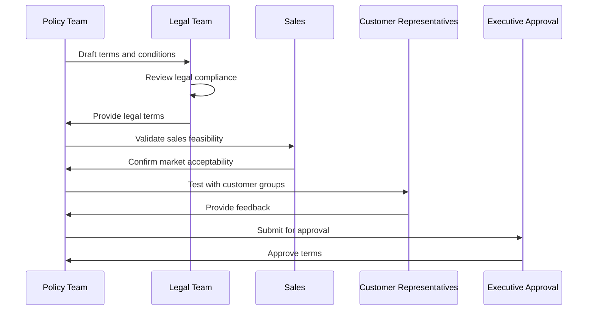

**Tasks:**
- `draft.TermsAndConditions` - Create contractual language
- `define.CustomerObligations` - Specify customer responsibilities
- `establish.CompanyCommitments` - Document organizational commitments
- `create.ExceptionPolicies` - Define exception handling rules
- `develop.DisputeResolution` - Establish conflict resolution procedures

### Create delivery procedures

Developing the operational procedures that enable consistent execution of delivery policies across the organization.

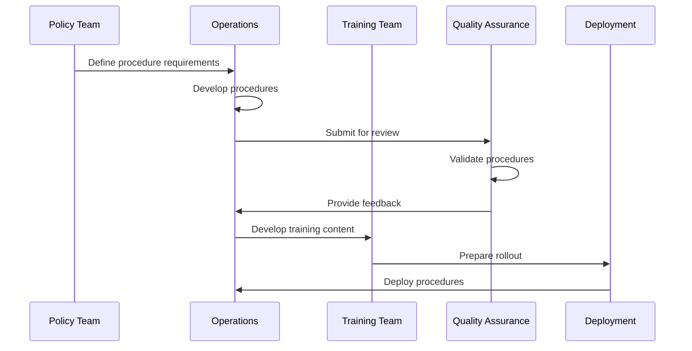

**Tasks:**
- `design.DeliveryWorkflows` - Create process flows
- `develop.OperatingProcedures` - Document step-by-step procedures
- `create.DecisionCriteria` - Define decision rules
- `establish.EscalationProcedures` - Document escalation paths
- `develop.ExceptionHandling` - Create exception procedures

### Document policy framework

Creating comprehensive documentation of all delivery service policies, ensuring clarity, completeness, and accessibility.

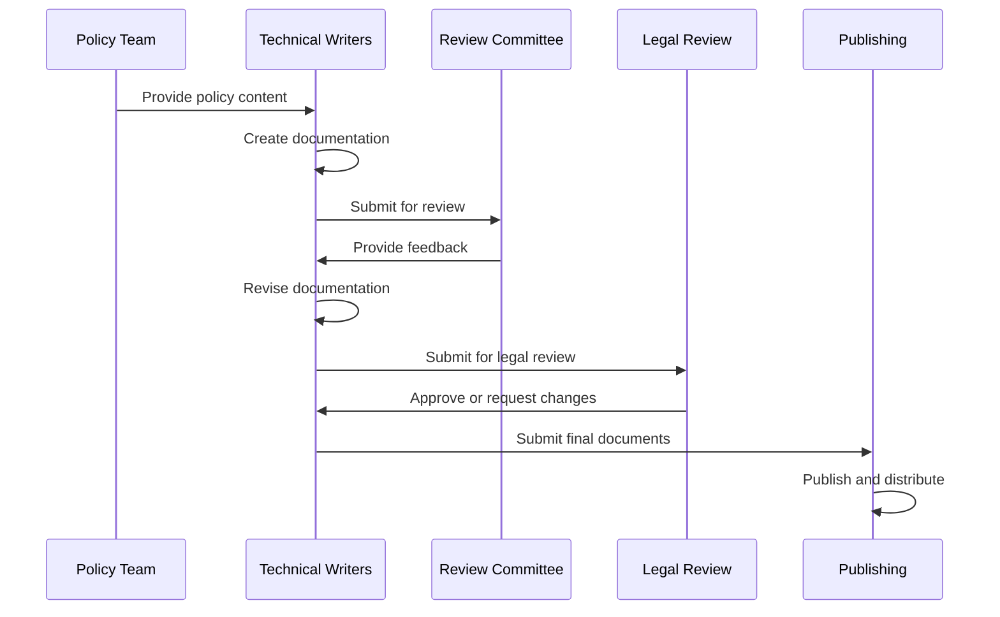

**Tasks:**
- `create.PolicyDocuments` - Write policy documentation
- `develop.PolicyManual` - Compile comprehensive manual
- `create.QuickReferenceGuides` - Develop summary materials
- `establish.VersionControl` - Implement document management
- `maintain.PolicyRepository` - Manage policy library

### Communicate policies

Ensuring all stakeholders understand and can access delivery service policies through effective communication and training.

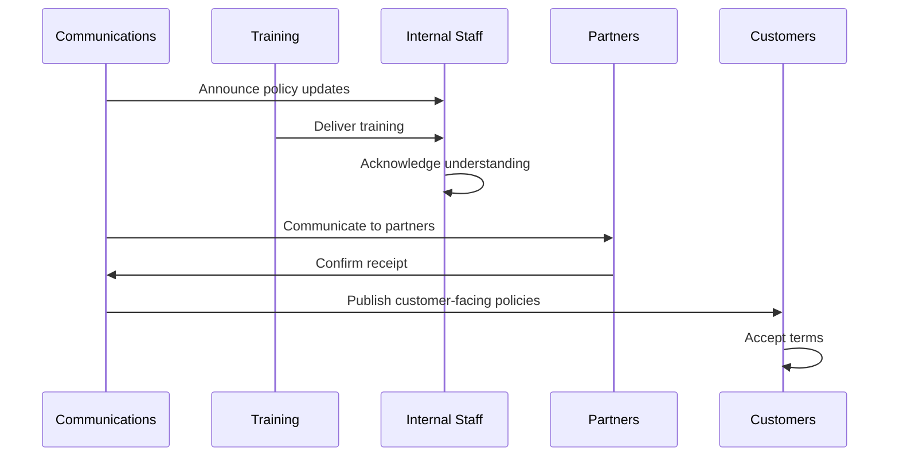

**Tasks:**
- `develop.CommunicationPlan` - Create rollout strategy
- `deliver.StaffTraining` - Train internal teams
- `communicate.PartnerRequirements` - Inform partners
- `publish.CustomerPolicies` - Make policies available to customers
- `track.PolicyAcknowledgment` - Monitor understanding

### Monitor policy compliance

Tracking adherence to delivery service policies and identifying areas of non-compliance for corrective action.

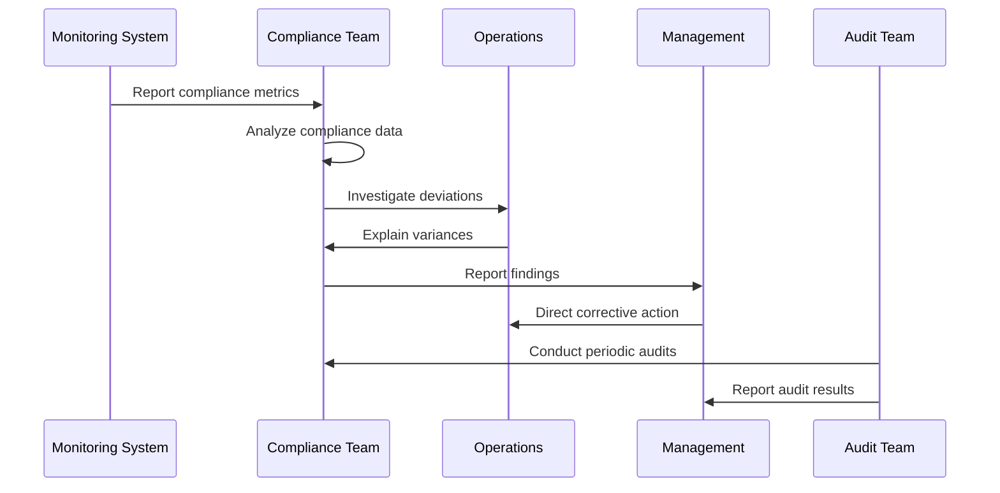

**Tasks:**
- `establish.ComplianceMetrics` - Define measurement criteria
- `monitor.PolicyAdherence` - Track compliance levels
- `investigate.Deviations` - Analyze non-compliance
- `report.ComplianceStatus` - Communicate findings
- `audit.PolicyCompliance` - Conduct formal audits

### Review and update policies

Periodically reviewing delivery service policies to ensure they remain relevant, effective, and aligned with changing business and market conditions.

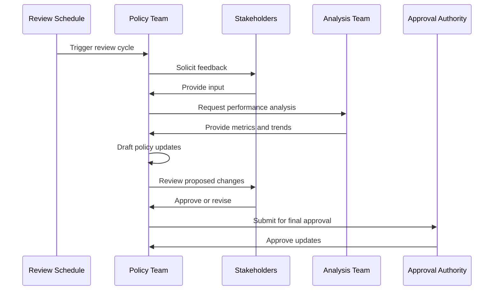

**Tasks:**
- `schedule.PolicyReviews` - Establish review calendar
- `gather.StakeholderFeedback` - Collect input on policies
- `analyze.PolicyEffectiveness` - Assess policy performance
- `draft.PolicyUpdates` - Create proposed changes
- `approve.PolicyChanges` - Obtain formal approval
- `deploy.PolicyUpdates` - Roll out revised policies

## RACI Matrix

| Activity | Responsible | Accountable | Consulted | Informed |
|----------|-------------|-------------|-----------|----------|
| Assess delivery requirements | Policy Analyst | Policy Manager | Operations, Legal, Sales | Executive team |
| Define service level standards | Policy Team | VP Operations | Finance, Customer Success | All departments |
| Establish terms and conditions | Policy Team, Legal | Legal Director | Sales, Customer Service | All staff |
| Create delivery procedures | Operations Team | Operations Director | QA, Training | Service teams |
| Document policy framework | Technical Writers | Policy Manager | Subject matter experts | All staff |
| Communicate policies | Communications | Policy Manager | Training, HR | All stakeholders |
| Monitor policy compliance | Compliance Team | Compliance Manager | Operations, Audit | Management |
| Review and update policies | Policy Team | Policy Manager | All stakeholders | All staff |

## Related Departments

- [Operations](/departments/Operations) - Policy implementation and compliance
- [Legal](/departments/Legal) - Contract and regulatory compliance
- [Customer Service](/departments/CustomerService) - Customer-facing policy application
- [Quality Assurance](/departments/QA) - Standards enforcement
- [Communications](/departments/Communications) - Policy communication
- [Training](/departments/Training) - Staff enablement
- [Compliance](/departments/Compliance) - Policy monitoring

## Related Occupations

- [Management Analysts](/occupations/ManagementAnalysts) - Policy development
- [Compliance Officers](/occupations/ComplianceOfficers) - Policy monitoring
- [Technical Writers](/occupations/TechnicalWriters) - Policy documentation
- [Lawyers](/occupations/Lawyers) - Legal review and terms
- [Training Specialists](/occupations/TrainingSpecialists) - Policy training
- [Logisticians](/occupations/Logisticians) - Delivery procedure development
- [Customer Service Managers](/occupations/CustomerServiceManagers) - Customer-facing policy

## Industry Variations

### Healthcare Provider

Healthcare delivery policies must address patient privacy (HIPAA), informed consent, clinical protocols, and payer requirements. Policies must balance patient care quality with operational efficiency and regulatory compliance.

**Industry-Specific Activities:**
- Define patient care delivery standards
- Establish clinical protocol policies
- Create informed consent procedures
- Develop HIPAA-compliant communication policies
- Establish emergency care delivery policies
- Define payer-specific delivery requirements

### Banking

Banking delivery policies address regulatory compliance, privacy, security, and customer communication requirements. Policies must cover both physical and digital delivery channels with appropriate controls.

**Industry-Specific Activities:**
- Establish secure document delivery policies
- Define digital banking delivery standards
- Create regulatory notice delivery procedures
- Develop privacy-compliant communication policies
- Establish fraud alert delivery protocols
- Define accessibility standards for all channels

### Aerospace and Defense

Defense delivery policies must address security classifications, export controls (ITAR), and government contract requirements. Policies must ensure compliance with defense acquisition regulations.

**Industry-Specific Activities:**
- Establish classified delivery procedures
- Define ITAR-compliant delivery policies
- Create government contract delivery standards
- Develop security clearance verification procedures
- Establish chain of custody documentation
- Define contractor delivery requirements

### E-commerce and Retail

Retail delivery policies focus on customer experience, shipping options, returns, and omnichannel fulfillment. Policies must balance customer expectations with cost efficiency.

**Industry-Specific Activities:**
- Define shipping options and timelines
- Establish return and exchange policies
- Create omnichannel delivery standards
- Develop last-mile delivery policies
- Establish package handling procedures
- Define international shipping policies

### Professional Services

Professional services delivery policies address engagement scope, deliverable acceptance, intellectual property, and confidentiality. Policies must support knowledge-based delivery models.

**Industry-Specific Activities:**
- Define deliverable acceptance criteria
- Establish intellectual property policies
- Create confidentiality and NDA procedures
- Develop engagement scope change policies
- Establish quality review requirements
- Define client communication standards

### Telecommunications

Telecom delivery policies address service activation, installation, service level agreements, and outage communication. Policies must comply with FCC regulations and industry standards.

**Industry-Specific Activities:**
- Define service activation timelines
- Establish installation scheduling policies
- Create service level agreement standards
- Develop outage notification procedures
- Establish network access policies
- Define equipment delivery and return policies

## Policy Components

| Component | Description | Key Elements |
|-----------|-------------|--------------|
| Service Levels | Performance commitments | Response time, resolution time, availability |
| Terms and Conditions | Contractual requirements | Liability, warranties, acceptance |
| Delivery Methods | Channel standards | Physical, digital, hybrid delivery |
| Communication | Customer interaction | Notifications, confirmations, updates |
| Exceptions | Non-standard handling | Escalation, approvals, workarounds |
| Compliance | Regulatory requirements | Industry regulations, privacy, security |

## Related Processes

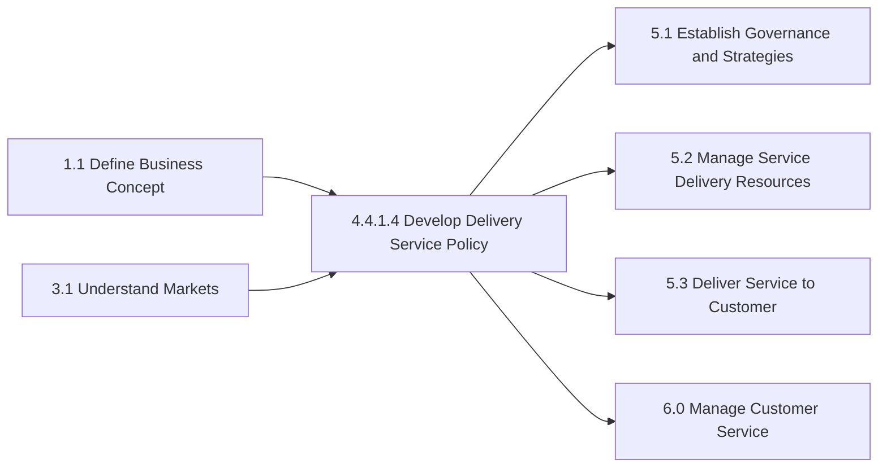

## Metrics & KPIs

| Metric | Description | Target |
|--------|-------------|--------|
| Policy Compliance Rate | Adherence to delivery policies | >95% |
| Policy Currency | Policies reviewed within cycle | 100% |
| Staff Policy Knowledge | Training completion rate | >95% |
| Customer Policy Awareness | Customer acknowledgment rate | >90% |
| Exception Rate | Deliveries requiring exceptions | <5% |
| Dispute Resolution Time | Time to resolve policy disputes | <48 hours |
| Policy Audit Findings | Critical findings per audit | 0 |
| Customer Satisfaction | Policy-related satisfaction score | >4.0/5.0 |
| Policy Change Cycle Time | Time from request to deployment | <30 days |
| Regulatory Compliance | Compliance with regulations | 100% |

---

*Source: APQC PCF 10346 (4.4.1.4) - Cross-Industry*
