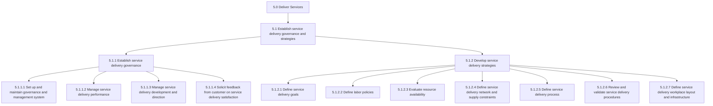
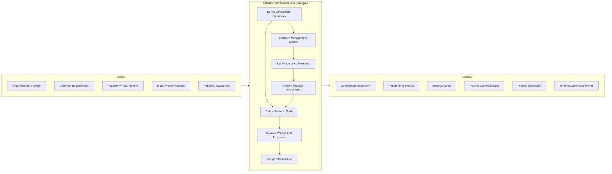
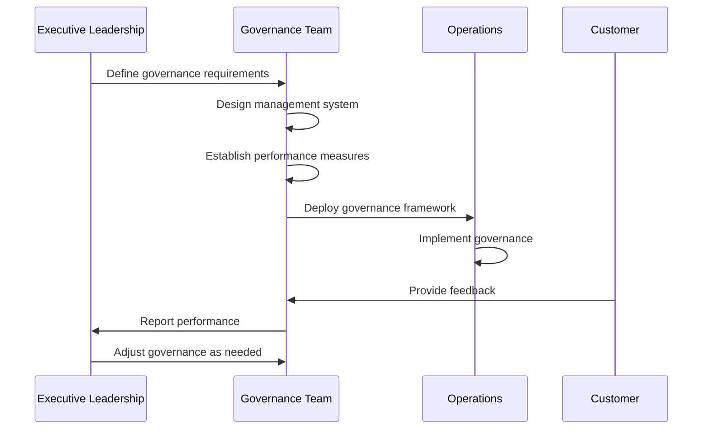
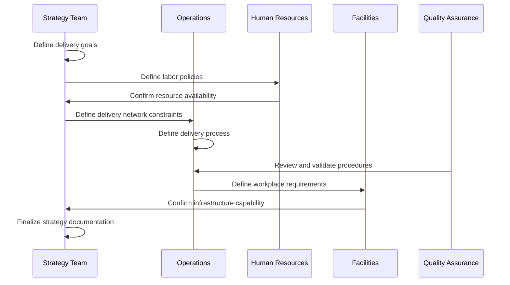
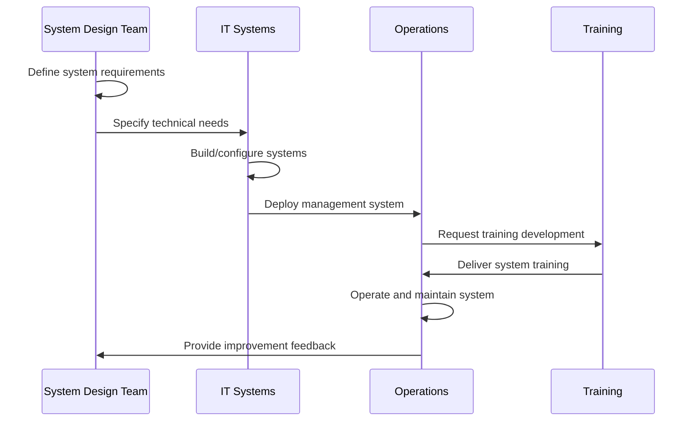
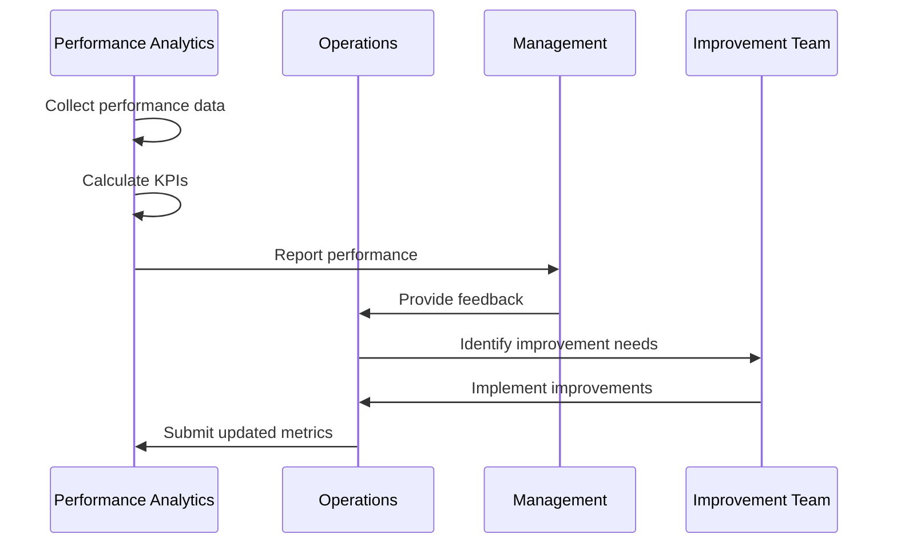
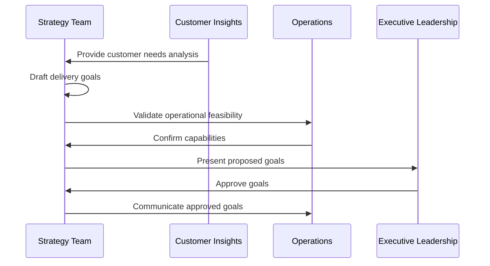
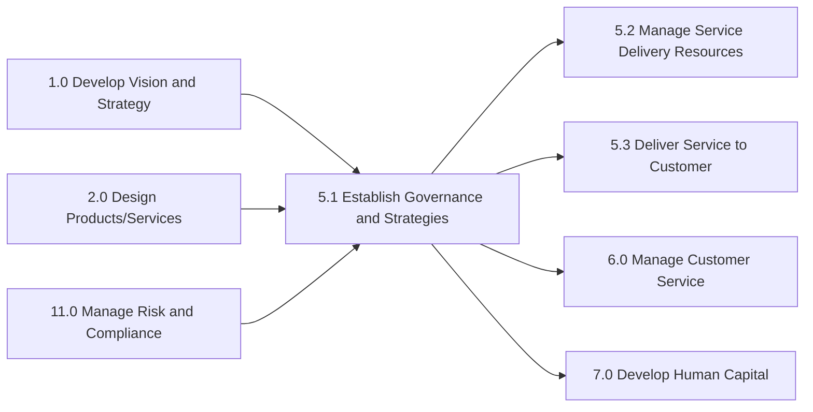

# Establish service delivery governance and strategies

> Creating rules and regulations for service delivery to the customer. Establish a system to manage performance, delivery, and direction of service delivery. Engage with the customer for satisfaction feedback. Define goals, policies, processes, and workplace layout and infrastructure as a part of the service delivery strategy.

## Overview

Establish service delivery governance and strategies (APQC 5.1) is the foundational process group within the Deliver Services category. This process establishes the framework, rules, and strategic direction that guide all service delivery activities. It ensures consistency, quality, and alignment with organizational objectives while remaining responsive to customer needs and market conditions.

The process encompasses two major sub-processes: establishing governance structures (the oversight mechanisms, performance management systems, and feedback loops) and developing delivery strategies (the goals, policies, processes, and infrastructure that enable effective service delivery). Together, these create the operating framework within which service delivery resources are managed and services are rendered to customers.

Organizations that excel at this process demonstrate higher customer satisfaction, better resource utilization, and more consistent service quality. The governance framework provides the guardrails for decision-making while the strategies provide direction for continuous improvement and market responsiveness.

## Process Hierarchy



## Key Statistics

| Metric | Value |
|--------|-------|
| APQC Code | 20026 |
| Hierarchy ID | 5.1 |
| Level | Process Group |
| Category | [Deliver Services](/processes/05-Services) |
| Sub-Processes | 2 |
| Activities | 11 |

## Process Flow



## GraphDL Semantic Structure

```
establish.ServiceDeliveryGovernance.and.Strategies
```

| Component | Value | Description |
|-----------|-------|-------------|
| Verb | `establish` | Primary action of creating and setting up |
| Object | `ServiceDeliveryGovernance` | Oversight and management framework |
| Preposition | `and` | Conjunction connecting two objects |
| PrepObject | `Strategies` | Strategic direction and approaches |

**Decomposed Semantic Structures:**
- `establish.ServiceDeliveryGovernance` - Set up governance systems
- `develop.ServiceDeliveryStrategies` - Create strategic frameworks
- `manage.ServiceDeliveryPerformance` - Monitor and control performance
- `solicit.Feedback.from.Customer` - Gather satisfaction input
- `define.ServiceDeliveryGoals` - Establish delivery objectives

## Activities

### 5.1.1 - Establish service delivery governance

Establishing service delivery governance through a system that manages performance, development, and direction. Allow for customer feedback on delivery satisfaction.



**Tasks:**
- `setUp.GovernanceManagementSystem` - Create management system structure
- `manage.ServiceDeliveryPerformance` - Monitor and control delivery performance
- `manage.ServiceDeliveryDevelopmentAndDirection` - Guide service evolution
- `solicit.CustomerFeedback` - Gather and process customer input

### 5.1.2 - Develop service delivery strategies

Constructing strategies that identify goals, policies, processes, and procedures in relation to service delivery. Review and validate strategies. Define the workplace layout and infrastructure.



**Tasks:**
- `define.ServiceDeliveryGoals` - Establish delivery objectives
- `define.LaborPolicies` - Set workforce policies
- `evaluate.ResourceAvailability` - Assess available resources
- `define.NetworkAndSupplyConstraints` - Identify delivery limitations
- `define.ServiceDeliveryProcess` - Create delivery procedures
- `review.ServiceDeliveryProcedures` - Validate delivery approaches
- `define.WorkplaceLayoutAndInfrastructure` - Design delivery environment

### 5.1.1.1 - Set up and maintain service delivery governance and management system

Providing a system for which to manage customer needs and a structure for which to facilitate service delivery to fulfill those needs.



**Tasks:**
- `define.SystemRequirements` - Establish management system needs
- `configure.ManagementSystem` - Set up governance technology
- `deploy.ManagementSystem` - Roll out to operations
- `maintain.ManagementSystem` - Keep system current and effective

### 5.1.1.2 - Manage service delivery performance

Conducting and implementing performance measures to ensure successful delivery of service to the customer.



**Tasks:**
- `collect.PerformanceData` - Gather service delivery metrics
- `analyze.PerformanceMetrics` - Evaluate delivery effectiveness
- `report.Performance` - Communicate results to stakeholders
- `implement.PerformanceImprovements` - Execute enhancement actions

### 5.1.2.1 - Define service delivery goals

Aligning organization practices to meet the needs of the customer by creating service delivery goals.



**Tasks:**
- `analyze.CustomerNeeds` - Understand customer requirements
- `draft.DeliveryGoals` - Create goal statements
- `validate.GoalFeasibility` - Confirm achievability
- `communicate.ApprovedGoals` - Share goals with organization

## RACI Matrix

| Activity | Responsible | Accountable | Consulted | Informed |
|----------|-------------|-------------|-----------|----------|
| Define governance framework | Governance Team | COO | Legal, Compliance | All managers |
| Set up management system | IT, Operations | Service Director | Vendors | All staff |
| Establish performance measures | Analytics Team | VP Services | Operations, Finance | Executive team |
| Manage service delivery performance | Operations Manager | Service Director | QA, Finance | All staff |
| Solicit customer feedback | Customer Success | Service Director | Sales, Marketing | Executive team |
| Define service delivery goals | Strategy Team | VP Services | Operations, Sales | All staff |
| Define labor policies | HR | CHRO | Legal, Operations | All staff |
| Evaluate resource availability | Resource Manager | HR Director | Finance | Department heads |
| Define delivery network constraints | Operations | COO | Logistics, Partners | Service teams |
| Define service delivery process | Process Team | Operations Director | QA, Training | All service staff |
| Review and validate procedures | QA Team | QA Director | Operations, Legal | Management |
| Define workplace infrastructure | Facilities | COO | IT, Safety | All staff |

## Related Departments

- [Operations](/departments/Operations) - Primary strategy implementation
- [Strategy](/departments/Strategy) - Strategic direction and planning
- [Human Resources](/departments/HR) - Labor policies and resource planning
- [Quality Assurance](/departments/QA) - Process validation and standards
- [Information Technology](/departments/IT) - Management systems and infrastructure
- [Customer Success](/departments/CustomerSuccess) - Customer feedback management
- [Facilities](/departments/Facilities) - Workplace design and infrastructure

## Related Occupations

- [General and Operations Managers](/occupations/GeneralManagers) - Governance leadership
- [Management Analysts](/occupations/ManagementAnalysts) - Strategy development
- [Human Resources Managers](/occupations/HRManagers) - Labor policy development
- [Quality Control Analysts](/occupations/QualityAnalysts) - Process validation
- [Business Operations Specialists](/occupations/BusinessOperations) - Process design
- [Training and Development Managers](/occupations/TrainingManagers) - Capability development
- [Market Research Analysts](/occupations/MarketResearchAnalysts) - Customer feedback analysis

## Industry Variations

### Healthcare Provider

Healthcare governance strategies must integrate with clinical governance, patient safety programs, and regulatory compliance frameworks. Goals focus on clinical outcomes, patient satisfaction, and quality measures.

**Industry-Specific Activities:**
- Establish clinical governance committees
- Define patient safety protocols
- Align with Joint Commission standards
- Integrate with quality improvement programs (QIP)
- Establish infection control governance

### Banking

Banking service delivery governance emphasizes regulatory compliance, risk management, and cybersecurity. Strategies must address omnichannel delivery and evolving fintech landscape.

**Industry-Specific Activities:**
- Establish regulatory compliance governance
- Define fraud prevention strategies
- Create cybersecurity protocols
- Design omnichannel service delivery framework
- Establish data privacy governance (GDPR, CCPA)

### Aerospace and Defense

Defense sector governance requires security clearance management, ITAR compliance, and government contract administration. Strategies focus on long-term contracts and specialized expertise.

**Industry-Specific Activities:**
- Establish security clearance governance
- Define ITAR compliance procedures
- Create government contract management framework
- Establish supplier governance for classified work
- Define program management office standards

### Professional Services

Professional services governance emphasizes methodology standards, knowledge management, and professional ethics. Strategies focus on expertise development and client relationship management.

**Industry-Specific Activities:**
- Establish practice area governance
- Define knowledge management strategy
- Create professional development framework
- Establish engagement risk governance
- Define quality review procedures

### Airline

Airline governance integrates with aviation safety management systems. Strategies emphasize operational efficiency, safety compliance, and customer experience across touchpoints.

**Industry-Specific Activities:**
- Integrate with Safety Management System (SMS)
- Establish flight operations governance
- Define crew management policies
- Create ground operations standards
- Establish customer experience governance

### Retail

Retail governance focuses on consistent customer experience across channels. Strategies emphasize omnichannel integration, labor optimization, and store operations standards.

**Industry-Specific Activities:**
- Establish store operations governance
- Define omnichannel service standards
- Create labor scheduling policies
- Establish loss prevention governance
- Define customer service escalation procedures

## Sub-Processes

| Process | Code | Description |
|---------|------|-------------|
| [Establish service delivery governance](./Governance.mdx) | 5.1.1 | Create governance systems for performance and direction |
| [Set up and maintain service delivery governance and management system](./ManagementSystem.mdx) | 5.1.1.1 | Provide system for managing customer needs |
| Manage service delivery performance | 5.1.1.2 | Implement and monitor performance measures |
| Manage service delivery development and direction | 5.1.1.3 | Guide service evolution and improvement |
| Solicit feedback from customer on service delivery satisfaction | 5.1.1.4 | Gather customer satisfaction input |
| Develop service delivery strategies | 5.1.2 | Create strategic delivery frameworks |
| Define service delivery goals | 5.1.2.1 | Establish delivery objectives |
| Define labor policies | 5.1.2.2 | Set workforce policies |
| Evaluate resource availability | 5.1.2.3 | Assess available resources |
| Define service delivery network and supply constraints | 5.1.2.4 | Identify delivery limitations |
| Define service delivery process | 5.1.2.5 | Create delivery procedures |
| Review and validate service delivery procedures | 5.1.2.6 | Verify delivery approaches |
| Define service delivery workplace layout and infrastructure | 5.1.2.7 | Design delivery environment |

## Related Processes



## Metrics & KPIs

| Metric | Description | Target |
|--------|-------------|--------|
| Governance Compliance Rate | Adherence to governance policies | >95% |
| Strategy Execution Score | Progress on strategic initiatives | >85% |
| Policy Currency | Percentage of policies reviewed within cycle | 100% |
| Customer Feedback Response Rate | Feedback acted upon within SLA | >90% |
| Process Standardization | Processes following standard procedures | >90% |
| Goal Achievement Rate | Strategic goals met on time | >80% |
| Employee Policy Awareness | Staff understanding of policies | >95% |
| Infrastructure Availability | System uptime for governance tools | >99.5% |
| Audit Finding Resolution | Governance audit findings resolved | >90% |
| Continuous Improvement Rate | Improvements implemented per period | >10/quarter |

---

*Source: APQC PCF 20026 (5.1) - Cross-Industry*
