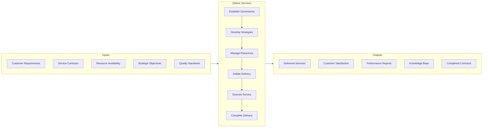
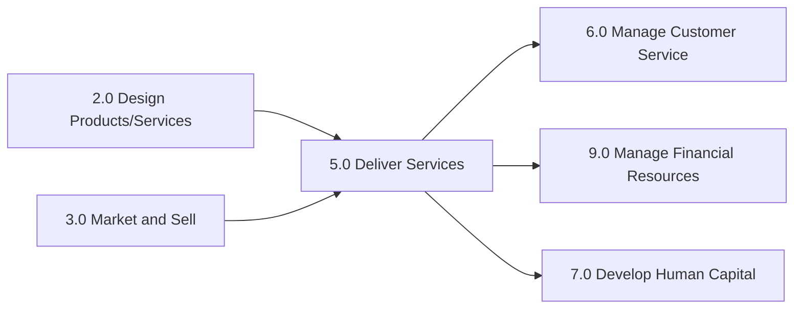

# Deliver Services

> Offering services to customers. This is the act of providing service delivery as a core business practice and covers identifying strategies for performing service delivery, managing resources, and delivering services to the customer.

## Overview

Deliver Services is the fifth major category in the APQC Process Classification Framework (Category 5.0). Unlike Category 4.0 (Deliver Physical Products) which focuses on tangible goods logistics, this category encompasses all processes related to providing intangible services to customers. It establishes the governance structures, strategic frameworks, resource management practices, and operational procedures required to deliver services effectively.

This category is fundamental to service-oriented businesses including professional services, consulting, healthcare, financial services, hospitality, education, and technology services. Even manufacturing organizations increasingly rely on these processes as they expand into service-based revenue streams.

## Process Hierarchy

```mermaid
graph TD
    C5["5.0 Deliver Services"] --> G51["5.1 Establish service delivery governance and strategies"]
    C5 --> G52["5.2 Manage service delivery resources"]
    C5 --> G53["5.3 Deliver service to customer"]

    G51 --> P511["5.1.1 Establish service delivery governance"]
    G51 --> P512["5.1.2 Develop service delivery strategies"]

    P511 --> A5111["5.1.1.1 Set up and maintain service delivery governance and management system"]
    P511 --> A5112["5.1.1.2 Manage service delivery performance"]
    P511 --> A5113["5.1.1.3 Manage service delivery development and direction"]
    P511 --> A5114["5.1.1.4 Solicit feedback from customer on service delivery satisfaction"]

    P512 --> A5121["5.1.2.1 Define service delivery goals"]
    P512 --> A5122["5.1.2.2 Define labor policies"]
    P512 --> A5123["5.1.2.3 Evaluate resource availability"]
    P512 --> A5124["5.1.2.4 Define service delivery network and supply constraints"]
    P512 --> A5125["5.1.2.5 Define service delivery process"]
    P512 --> A5126["5.1.2.6 Review and validate service delivery procedures"]
    P512 --> A5127["5.1.2.7 Define service delivery workplace layout and infrastructure"]

    G52 --> P521["5.2.1 Manage service delivery resource demand"]
    G52 --> P522["5.2.2 Create and manage resource plan"]
    G52 --> P523["5.2.3 Enable service delivery resources"]

    G53 --> P531["5.3.1 Initiate service delivery"]
    G53 --> P532["5.3.2 Execute service delivery"]
    G53 --> P533["5.3.3 Complete service delivery"]
```



## Key Statistics

| Metric | Value |
|--------|-------|
| APQC Code | 20025 |
| Hierarchy ID | 5.0 |
| Level | Category |
| Process Groups | 3 |
| Total Sub-Processes | 50+ |
| Industry Variants | 19 |

## Process Flow



## GraphDL Semantic Structure

```
deliver.Services
```

| Component | Value | Description |
|-----------|-------|-------------|
| Verb | `deliver` | Primary action of providing to the customer |
| Object | `Services` | Intangible offerings provided to customers |
| Preposition | - | Not applicable at category level |
| PrepObject | - | Not applicable at category level |

## Process Groups

### 5.1 - Establish service delivery governance and strategies

Creating rules and regulations for service delivery to the customer. Establish a system to manage performance, delivery, and direction of service delivery. Engage with the customer for satisfaction feedback. Define goals, policies, processes, and workplace layout and infrastructure as a part of the service delivery strategy.

**Sub-Processes:**
- [Establish service delivery governance](./Governance.mdx) (5.1.1)
- [Develop service delivery strategies](./GovernanceStrategies.mdx) (5.1.2)

### 5.2 - Manage service delivery resources

Understanding the demands on resources and creating a plan to enable the delivery of services via those resources. This includes managing resource demand, creating resource plans, and enabling resources through training and development.

**Sub-Processes:**
- Manage service delivery resource demand (5.2.1)
- Create and manage resource plan (5.2.2)
- Enable service delivery resources (5.2.3)

### 5.3 - Deliver service to customer

Rendering service to the customer by initiating, executing, and completing tasks associated with service delivery. This covers the full lifecycle from initial engagement through final delivery and closeout.

**Sub-Processes:**
- Initiate service delivery (5.3.1)
- Execute service delivery (5.3.2)
- Complete service delivery (5.3.3)

## RACI Matrix

| Activity | Responsible | Accountable | Consulted | Informed |
|----------|-------------|-------------|-----------|----------|
| Establish governance | Service Delivery Manager | COO | Legal, Compliance | All service staff |
| Develop strategies | Strategy Team | VP Services | Operations, Finance | Executive team |
| Manage resources | Resource Manager | Service Delivery Manager | HR, Finance | Project managers |
| Initiate service | Project Manager | Account Manager | Customer | Service team |
| Execute service | Service Team | Project Manager | Customer, QA | Management |
| Complete service | Project Manager | Account Manager | Finance | Customer |

## Related Departments

- [Operations](/departments/Operations/index) - Primary service delivery execution
- [Customer Success](/departments/CustomerSuccess) - Customer relationship management
- [Human Resources](/departments/HR/index) - Resource management and training
- [Quality Assurance](/departments/QA) - Service quality oversight
- [Finance](/departments/Finance/index) - Contract and financial management

## Related Occupations

- [General and Operations Managers](/occupations/GeneralManagers) - Overall service delivery oversight
- [Project Management Specialists](/occupations/ProjectManagers) - Service project management
- [Customer Service Representatives](/occupations/CustomerService) - Customer interaction
- [Training and Development Specialists](/occupations/TrainingSpecialists) - Resource enablement
- [Management Analysts](/occupations/Business/Operations/ManagementAnalysts) - Process improvement

## Industry Variations

### Healthcare Provider

Healthcare service delivery focuses on patient care quality, regulatory compliance (HIPAA, Joint Commission), and clinical outcomes. Service delivery governance emphasizes patient safety protocols and clinical standards.

**Industry-Specific Activities:**
- Establish clinical care protocols
- Manage patient flow and scheduling
- Ensure regulatory compliance
- Coordinate care across departments

### Banking

Banking service delivery emphasizes regulatory compliance, security, customer experience across channels (branch, digital, mobile), and risk management. Governance structures must address financial regulations and data protection.

**Industry-Specific Activities:**
- Manage branch and digital service delivery
- Ensure regulatory compliance (SOX, PCI)
- Coordinate omnichannel customer experience
- Implement fraud prevention measures

### Professional Services (Consulting)

Professional services focus on knowledge delivery, client engagement, project-based service delivery, and intellectual capital management. Resource utilization and expertise matching are critical.

**Industry-Specific Activities:**
- Match expertise to client requirements
- Manage billable utilization
- Transfer knowledge to clients
- Maintain professional certifications

### Airline

Airline service delivery encompasses flight operations, passenger services, ground operations, and crew management. Safety regulations and operational efficiency are paramount.

**Industry-Specific Activities:**
- Manage flight operations
- Deliver cabin services
- Coordinate ground operations
- Manage crew scheduling

### Retail

Retail service delivery focuses on customer experience across physical and digital channels, inventory availability, and fulfillment operations. Speed and convenience drive service strategies.

**Industry-Specific Activities:**
- Manage omnichannel service delivery
- Coordinate store operations
- Enable buy-online-pickup-in-store
- Deliver customer support services

## Sub-Processes

| Process | Code | Description |
|---------|------|-------------|
| [Establish service delivery governance and strategies](./GovernanceStrategies.mdx) | 5.1 | Create governance frameworks and strategies |
| [Establish service delivery governance](./Governance.mdx) | 5.1.1 | Set up governance system for performance and direction |
| [Set up and maintain service delivery governance and management system](./ManagementSystem.mdx) | 5.1.1.1 | Provide system for managing customer needs |
| [Develop and maintain delivery service policy](./DeliveryPolicy.mdx) | 4.4.1.4 | Establish rules and delivery plans |

## Related Processes



## Metrics & KPIs

| Metric | Description | Target |
|--------|-------------|--------|
| Service Delivery Rate | Percentage of services delivered on time | >95% |
| Customer Satisfaction Score | Post-delivery customer satisfaction rating | >4.5/5.0 |
| Resource Utilization | Percentage of resources actively engaged | >80% |
| First-Time Resolution Rate | Issues resolved without escalation | >85% |
| Service Quality Index | Composite quality measure | >90% |
| Contract Renewal Rate | Percentage of service contracts renewed | >85% |

---

*Source: APQC PCF 20025 (5.0) - Cross-Industry*
