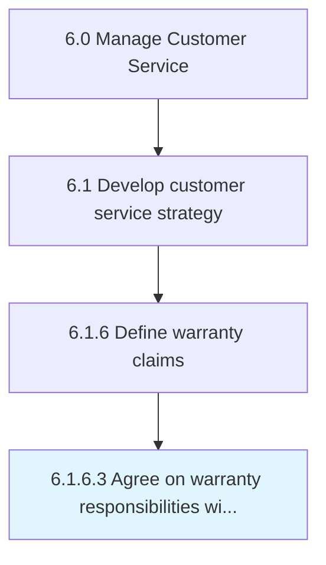

# Agree on warranty responsibilities with suppliers

> Negotiating with manufacturers and dealers the obligations of each party in upholding warranties.

## Overview

Activity 6.1.6.3 is an activity within the Manage Customer Service framework. 

Negotiating with manufacturers and dealers the obligations of each party in upholding warranties.

## Process Hierarchy



## Key Statistics

| Metric | Value |
|--------|-------|
| APQC Code | 20090 |
| Hierarchy ID | 6.1.6.3 |
| Level | Activity |
| Parent | [6.1.6](../) |
| Sub-Processes | 0 |


## GraphDL Semantic Structure

```
agree.OnWarrantyResponsibilitiesWithSuppliers
```

| Component | Value | Description |
|-----------|-------|-------------|
| Verb | `agree` | Primary action |
| Object | `on warranty responsibilities with suppliers` | Direct object |


## Related Concepts

- [WarrantyResponsibilitiesWithSuppliers](/concepts/WarrantyResponsibilitiesWithSuppliers)


---

*Source: APQC PCF 20090 (6.1.6.3) - APQC*
