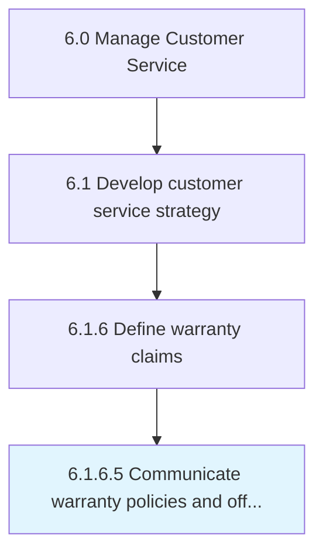

# Communicate warranty policies and offerings

> Communicating rules and updates via training manuals for new products and training resources.

## Overview

Activity 6.1.6.5 is an activity within the Manage Customer Service framework. 

Communicating rules and updates via training manuals for new products and training resources.

## Process Hierarchy



## Key Statistics

| Metric | Value |
|--------|-------|
| APQC Code | 12673 |
| Hierarchy ID | 6.1.6.5 |
| Level | Activity |
| Parent | [6.1.6](../) |
| Sub-Processes | 0 |


## GraphDL Semantic Structure

```
communicate.WarrantyPoliciesAndOfferings
```

| Component | Value | Description |
|-----------|-------|-------------|
| Verb | `communicate` | Primary action |
| Object | `warranty policies and offerings` | Direct object |


## Related Concepts

- [WarrantyPolicies](/concepts/WarrantyPolicies)
- [Offerings](/concepts/Offerings)


---

*Source: APQC PCF 12673 (6.1.6.5) - APQC*
