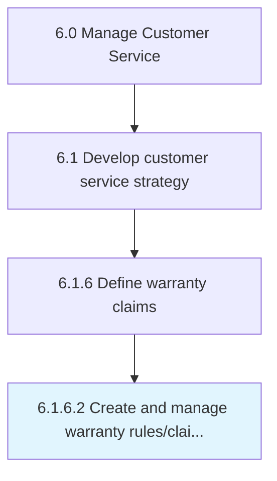

# Create and manage warranty rules/claim codes for products

> Establishing and maintaining claims processing and routing rules.

## Overview

Activity 6.1.6.2 is an activity within the Manage Customer Service framework. 

Establishing and maintaining claims processing and routing rules. Establish and maintain claims processing and routing rules for product warranties, coverage lists, repair, fault, trouble codes, repair time setup, and warranty policy registration. This also includes rolling out the codes and rules, and the improvements/updates to these rules and codes via systematic updates.

## Process Hierarchy



## Key Statistics

| Metric | Value |
|--------|-------|
| APQC Code | 16890 |
| Hierarchy ID | 6.1.6.2 |
| Level | Activity |
| Parent | [6.1.6](../) |
| Sub-Processes | 0 |


## GraphDL Semantic Structure

```
create.AndManageWarrantyRulesclaimCodes.for.Products
```

| Component | Value | Description |
|-----------|-------|-------------|
| Verb | `create` | Primary action |
| Object | `and manage warranty rules/claim codes` | Direct object |
| Preposition | `for` | Relationship |
| PrepObject | `products` | Indirect object |


## Related Concepts

- [WarrantyRulesCodes](/concepts/WarrantyRulesCodes)
- [Products](/concepts/Products)
- [WarrantyClaimCodes](/concepts/WarrantyClaimCodes)
- [Products](/concepts/Products)
- [WarrantyRulesCodes](/concepts/WarrantyRulesCodes)
- [Products](/concepts/Products)
- [WarrantyClaimCodes](/concepts/WarrantyClaimCodes)
- [Products](/concepts/Products)


---

*Source: APQC PCF 16890 (6.1.6.2) - APQC*
